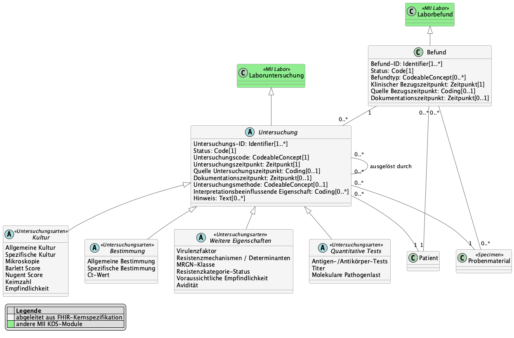
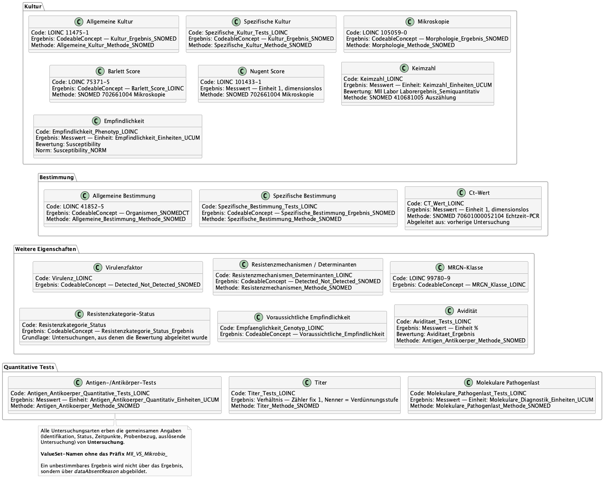

# UML-Diagramme - MII Implementation Guide Microbiology v2027.0.0-alpha.6

* [**Inhaltsverzeichnis**](toc.md)
* [**Anleitung**](guidance.md)
* **UML-Diagramme**

## UML-Diagramme

> **Während der Migration geschrieben — vor der Veröffentlichung prüfen.** TODO:REVIEW — die englische Standardfassung dieser Seite ist eine Maschinenübersetzung dieses deutschen Textes. Diese deutsche Fassung trägt den Originalwortlaut der Simplifier-Quellseite; zu prüfen ist die englische Entsprechung (Gate C).

UML-Übersichten der Datenmodelle des Moduls **Mikrobiologie** und ihrer Beziehungen. Editierbare Quellen (z. B. PlantUML) gehören nach `input/images-source/`, die gerenderten Bilder nach `input/images/`.

Als abstraktere Version des Informationsmodells und zur besseren Verdeutlichung von Beziehungen der fachlichen Konzepte untereinander wurden UML-Klassendiagramme erstellt. Diese dienen nur zur Abbildung der Datenelemente und deren Beschreibungen. Verwendete Datentypen und Kardinalitäten sind nicht als verpflichtend anzusehen. Dies wird abschließend durch die FHIR-Profile festgelegt.

### Übersicht

Der mikrobiologische Befund fasst Untersuchungen zusammen. Alle Untersuchungen teilen sich eine gemeinsame Basisklasse, die von der Laboruntersuchung des Labor-Moduls abgeleitet ist; die fachlichen Ausprägungen sind in vier Gruppen gegliedert.

Zur besseren Lesbarkeit findet sich das vollständige Diagramm nochmal [hier](https://github.com/medizininformatik-initiative/kerndatensatzmodul-mikrobiologie/blob/main/implementation-guides/modulmikrobio-2027/images/mii-mikrobio-informationsmodell.png)

### Untersuchungsarten

Die einzelnen Untersuchungsarten mit dem jeweils verwendeten Untersuchungscode, dem Ergebnis und dem Verfahren. Die gemeinsamen Angaben aus der Basisklasse **Untersuchung** sind hier nicht wiederholt.

Zur besseren Lesbarkeit findet sich das vollständige Diagramm nochmal [hier](https://github.com/medizininformatik-initiative/kerndatensatzmodul-mikrobiologie/blob/main/implementation-guides/modulmikrobio-2027/images/mii-mikrobio-untersuchungsarten.png)

