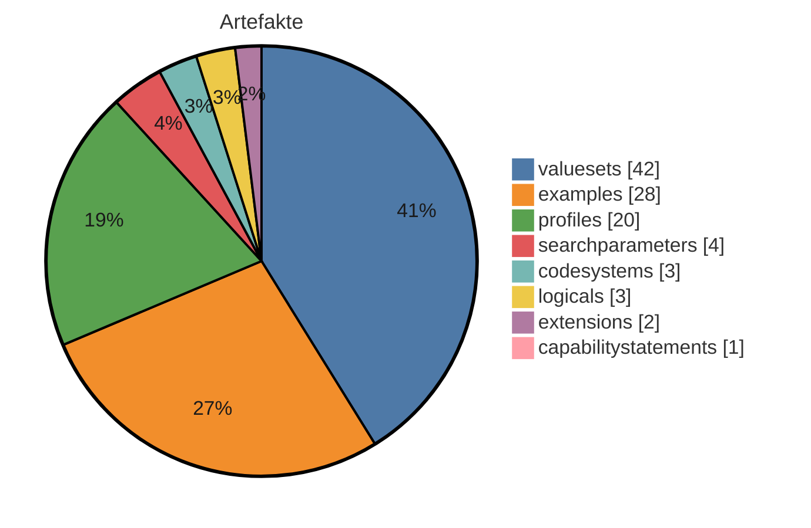

# IG-Statistik — mikrobiologie-migrated-2027.0.0-alpha.6

_Modus: `static` · Stand: 2026-08-25T18:08:18Z · Commit: `fdf3190`_

## Kennzahlen-Überblick

### Artefakte (Σ 103 publiziert)

_Hier wird gezählt, wie viele FHIR-Bausteine (Profile, Extensions, ValueSets usw.) der IG je Typ definiert._

| Typ | Anzahl |
|---|---|
| valuesets | 42 |
| examples | 28 |
| profiles | 20 |
| searchparameters | 4 |
| codesystems | 3 |
| logicals | 3 |
| extensions | 2 |
| capabilitystatements | 1 |

**⚠ Gegenprobe generiert-vs-deklariert** (`fsh-generated/resources`): `examples` deklariert 28 / generiert 27 — für Seiten-/Menü-Entscheidungen ist die generierte resourceType-Zählung maßgeblich; die FSH-Deklarationstypisierung kennt nur InstanceOf-Namen.

_Interne FSH-Konstrukte (nicht in Σ): 56 rulesets, 1 invariants._

## Inhaltsumfang & Repo-Hygiene

_Linguistische Kennzahlen zum Textumfang (Wörter je Seite, Durchschnitt) sowie Hinweise auf inhaltliche Dopplungen und nicht referenzierte Dateien (Dead-Code-Analogie) - hilft, Umfang und Aufräumpotenzial einzuschätzen._

| Kennzahl | Wert |
|---|---|
| Inhalts-Seiten | 24 |
| Wörter gesamt | 16817 |
| Ø Wörter / Seite | 700,7 |
| Median Wörter / Seite | 260 |
| kürzeste / längste Seite | 66 / 7576 Wörter |
| doppelte Inhaltsblöcke | 4 |
| identische Seiten (Gruppen) | 0 |
| Bilder nicht referenziert | 2 von 4 |
| Beispiele nicht in Narrativen | 7 von 28 |

_Heuristik: 'nicht referenziert' = Dateiname/Artefaktname kommt in keiner Erklärseite vor. Kein Beweis für Ungenutztheit (Referenz kann über Konfiguration/Build erfolgen)._

## Reife-Komponenten (gezählt)

_Gezählte Reife-Komponenten nebeneinander: Status, Vollständigkeit der Dokumentation, Beispiel-Abdeckung der Profile und Governance-Merkmale. Bewusst kein verdichteter Score und kein Freigabe-Urteil — die Einordnung bleibt menschlich._

| Komponente | Wert |
|---|---|
| Status | active |
| Doku-Vollständigkeit (Inhalt vs. Stubs) | 100 % |
| Beispiel-Abdeckung Profile | 100 % (20/20) |
| Governance (CI · ig.ini · publication · devcontainer) | 100/100 |

## Strategie: Wiederverwendung, Lock-in & Zukunftssicherheit

_Strategische Kennzahlen: Bindung an die Quellplattform (Lock-in), Anteil standardisierter Terminologie, Wiederverwendung externer Bausteine und Zukunftssicherheit (FHIR-Version, Pflege-Aktivität)._

| Kennzahl | Wert |
|---|---|
| Hersteller-Lock-in | 0/100 (gering) · 0 Direktiven/Seite |
| Standard-Terminologie-Anteil | 100 % (SNOMED CT, LOINC, ICD-10, UCUM) |
| Wiederverwendung externer Profile (Parents) | 95 % (20 von 21 Profil-Parents extern; abstrakte LM-Basistypen ausgeschlossen) |
| FHIR-Version | R4 — aktuell verbreitet |
| Dependency-Veraltung | 0 veraltet (Heuristik) |
| Pflege-Kadenz | 55.9 Commits/Jahr · letzter Commit vor 0 Tagen |

_Lock-in und Standard-Terminologie-Anteil sind grobe Heuristiken aus Textvorkommen. Heuristik aus CalVer-Jahr; exakt nur via Package-Registry (extern)._

## Risiko & Compliance

_Entscheidungsrelevante Risiken für die Freigabe: Terminologie-Lizenzen, unterdrückte Warnungen, Datenschutz-Substanz, Wissenskonzentration (Bus-Faktor) und Kompatibilitätsbruch zur Vorversion._

| Risiko | Bewertung |
|---|---|
| Terminologie-Lizenz | Lizenzbedarf möglich — SNOMED CT: lizenzpflichtig (Affiliate/Land), LOINC: frei (Registrierung), ICD-10: frei, UCUM: frei |
| Unterdrückte QA-Warnungen | 8 (davon 0 breit) → gering |
| Datenschutz-Seite (Substanz) | fehlt/nur Stub (0 Wörter) |
| PII-artige Beispieldaten | keine erkannt |
| Bus-Faktor (Wissenskonzentration) | 90 % Top-Autor → hoch |
| Breaking-Change-Risiko ggü. Vorversion | — (nur per Build/Vorversions-Diff) |

## Befunde & Einordnung

_Je Themenbereich der gemessene Befund und eine neutrale Einordnung, was er über den Guide aussagt — keine Handlungs- oder Migrationsanweisungen._

| Bereich | Befund | Einordnung |
|---|---|---|
| Artefakte (FSH) | 103 publiziert, FSH vorhanden | Zählt die publizierten Konformitätsressourcen und ob FSH-Quelltext vorliegt. FSH-Quellen machen den Bestand direkt les-, diff- und weiterverarbeitbar; ohne sie ist nur das generierte JSON/XML die Quelle. |
| Narrative | 24 Inhalts-Seiten, Format target | Anzahl und Format der Erklärseiten (source = Plattformformat, target = IG-Publisher-Format). Das Format bestimmt, welche Werkzeuge die Seiten unverändert verarbeiten können. |
| Direktiven | 0 (0 unbekannt) | Vorkommen plattformspezifischer Platzhalter/Tags, die nur die Quellplattform interpretiert. Je mehr davon, desto stärker ist die Darstellung an die Plattform gebunden (vgl. Lock-in-Kennzahl). |
| Dependencies | 4 (0 floating) | Deklarierte Paket-Abhängigkeiten und ihr Pinning. Floating-Einträge folgen automatisch neuen Versionen und machen Builds weniger reproduzierbar — der Wert zeigt, wie reproduzierbar der aktuelle Stand ist. |
| Mehrsprachigkeit | FSH-Übersetzung ja, Supplements 0 | Ob Übersetzungen in den FSH-Quellen (translation-Extensions) und/oder als Publisher-Supplements vorliegen. Die beiden Mechanismen decken unterschiedliche Textarten ab; der Wert zeigt den vorhandenen Stand, nicht den Bedarf. |
| Pflichtseiten | 13/13 im Zielformat | Wie viele Seiten des hinterlegten Pflicht-Rasters (mandatory_pages in dieser Datei) im Zielformat existieren. Die Aussagekraft hängt vom Raster ab: Nutzt ein Guide legitim ein anderes Seitenraster, wird das Raster korrigiert — nicht die Seiten als fehlend gewertet. |
| QC-Regeln | 12 definiert | Anzahl der im Projekt definierten Qualitätsregeln (qc/custom.rules.yaml). Statisch wird nur die Definition gezählt; Verletzungen zeigt erst der Qualitätslauf eines Builds. |
| Metadaten/Config | id kerndatensatzmodul-mikrobiologie, v2027.0.0-alpha.6 | Kern-Identität (id, Version) wie in sushi-config.yaml/package.json deklariert; die vollständigen Identitätsfelder stehen im Anhang. |

# Anhang: Detailaufschlüsselung

_Im Anhang steht jeder Einzelwert mit seiner Quelle, damit man die Kennzahlen nachvollziehen kann, ohne im Projekt suchen zu müssen._

## Identität & Herkunft

| Feld | Wert | Quelle |
|---|---|---|
| id | kerndatensatzmodul-mikrobiologie | sushi-config.yaml / package.json |
| canonical | https://www.medizininformatik-initiative.de/fhir/modul-mikrobio | sushi-config.yaml / package.json |
| packageId | de.medizininformatikinitiative.kerndatensatz.mikrobiologie | sushi-config.yaml / package.json |
| name | Kerndatensatzmodul Mikrobiologie | sushi-config.yaml / package.json |
| title | MII Implementation Guide Microbiology | sushi-config.yaml / package.json |
| version | 2027.0.0-alpha.6 | sushi-config.yaml / package.json |
| status | active | sushi-config.yaml / package.json |
| fhirVersion | 4.0.1 | sushi-config.yaml / package.json |
| license | CC-BY-4.0 | sushi-config.yaml / package.json |
| publisher | NUM-DIZ | sushi-config.yaml / package.json |
| calver | True | version-Regex |

## Dependencies

_Die FHIR-Pakete, auf denen der IG aufbaut, samt Version und ob diese fest oder offen angegeben ist._

| Package | Version | Pin |
|---|---|---|
| de.medizininformatikinitiative.kerndatensatz.laborbefund | 2026.0.3 | gepinnt |
| hl7.fhir.uv.crmi | 2.0.0 | gepinnt |
| hl7.fhir.uv.xver-r5.r4 | 0.1.0 | gepinnt |
| hl7.fhir.uv.ips | 1.1.0 | gepinnt |

## Pre-flight (Migration Gate 0)

- Lizenz-Evidenz: sushi-config.yaml/package.json → CC-BY-4.0; LICENSE → Attribution 4.0 International; input/pagecontent/metadata.md → CC-BY-4.0; input/pagecontent/index.md → Creative Commons — **WIDERSPRÜCHLICH**

- Canonical-Raum: 1 außerhalb + 6 id/url-abweichend → special-url-Prognose: 7

- Dependency-Gesundheit: old-style=keine; THO direkt gepinnt=False, Extensions-Pack=False — **Injektionsrisiko: der Publisher lädt zur Buildzeit das JEWEILS NEUESTE Release**; externe Parents: 2

- Narrative-Quellen: IG-Publisher-nativ (pagecontent + intro-notes)

- QA-Baseline: output/qa.json → err=109 warn=574 (Tue, 25 Aug, 2026 19:58:22 +0200)

## Artefakte (Quelle: input/fsh (FSH-Deklarationen))

_Jedes definierte Artefakt mit Typ, Name und Fundort in den Quelldateien._

| Typ | Name | InstanceOf | Quelle |
|---|---|---|---|
| CodeSystem | MII_CS_Mikrobio_MRGN_Ergebnis |  | input/fsh/codesystems/MII_CS_Mikrobio_MRGN_Ergebnis.fsh:1 |
| CodeSystem | MII_CS_Mikrobio_Resistenzkategorie |  | input/fsh/codesystems/MII_CS_Mikrobio_Resistenzkategorie.fsh:1 |
| CodeSystem | MII_CS_Mikrobio_Susceptibility_NORM |  | input/fsh/codesystems/MII_CS_Mikrobio_Susceptibility_Norm.fsh:1 |
| Extension | ExtensionObservation_TriggeredBy |  | input/fsh/extensions/ExtensionObservation_TriggeredBy.fsh:5 |
| Extension | MII_EX_Mikrobio_Empfindlichkeit_Norm |  | input/fsh/extensions/MII_EX_Mikrobio_Empfindlichkeit_Norm.fsh:1 |
| Instance | MII-CPS-Metadata-Mikrobio | CapabilityStatement | input/fsh/instances/MII-CPS-Metadata-Mikrobio.fsh:1 |
| Instance | mii-exa-mikrobio-allgemeine-bestimmung | MII_PR_Mikrobio_Allgemeine_Bestimmung | input/fsh/instances/mii-exa-mikrobio-allgemeine-bestimmung.fsh:1 |
| Instance | mii-exa-mikrobio-allgemeine-kultur | MII_PR_Mikrobio_Allgemeine_Kultur | input/fsh/instances/mii-exa-mikrobio-allgemeine-kultur.fsh:1 |
| Instance | mii-exa-mikrobio-antigen-antikoerper-quantitativ | MII_PR_Mikrobio_Antigen_Antikoerper_Quantitativ | input/fsh/instances/mii-exa-mikrobio-antigen-antikoerper-quantitativ.fsh:1 |
| Instance | mii-exa-mikrobio-aviditaet | MII_PR_Mikrobio_Aviditaet | input/fsh/instances/mii-exa-mikrobio-aviditaet.fsh:1 |
| Instance | mii-exa-mikrobio-barlett-score | MII_PR_Mikrobio_Barlett_Score | input/fsh/instances/mii-exa-mikrobio-barlett-score.fsh:1 |
| Instance | mii-exa-mikrobio-ct-wert | MII_PR_Mikrobio_Ct_Wert | input/fsh/instances/mii-exa-mikrobio-ct-wert.fsh:1 |
| Instance | mii-exa-mikrobio-patient-inline | Patient | input/fsh/instances/mii-exa-mikrobio-diagnostic-report.fsh:22 |
| Instance | mii-exa-mikrobio-diagnostic-report | MII_PR_Mikrobio_Diagnostic_Report | input/fsh/instances/mii-exa-mikrobio-diagnostic-report.fsh:29 |
| Instance | mii-exa-mikrobio-empfindlichkeit | MII_PR_Mikrobio_Empfindlichkeit | input/fsh/instances/mii-exa-mikrobio-empfindlichkeit.fsh:1 |
| Instance | mii-exa-mikrobio-keimzahl | MII_PR_Mikrobio_Keimzahl | input/fsh/instances/mii-exa-mikrobio-keimzahl.fsh:1 |
| Instance | mii-exa-mikrobio-mikroskopie | MII_PR_Mikrobio_Mikroskopie | input/fsh/instances/mii-exa-mikrobio-mikroskopie.fsh:1 |
| Instance | mii-exa-mikrobio-molekulare-pathogenlast | MII_PR_Mikrobio_Molekulare_Pathogenlast | input/fsh/instances/mii-exa-mikrobio-molekulare-pathogenlast.fsh:1 |
| Instance | mii-exa-mikrobio-mrgn-klasse-negativ | MII_PR_Mikrobio_MRGN_Klasse | input/fsh/instances/mii-exa-mikrobio-mrgn-klasse-negativ.fsh:7 |
| Instance | mii-exa-mikrobio-mrgn-klasse | MII_PR_Mikrobio_MRGN_Klasse | input/fsh/instances/mii-exa-mikrobio-mrgn-klasse.fsh:1 |
| Instance | mii-exa-mikrobio-nugent-score | MII_PR_Mikrobio_Nugent_Score | input/fsh/instances/mii-exa-mikrobio-nugent-score.fsh:1 |
| Instance | mii-exa-mikrobio-resistenzkategorie-vre-negativ | MII_PR_Mikrobio_Resistenzkategorie_Status | input/fsh/instances/mii-exa-mikrobio-resistenzkategorie-vre-negativ.fsh:7 |
| Instance | mii-exa-mikrobio-resistenzkategorie-vre-positiv | MII_PR_Mikrobio_Resistenzkategorie_Status | input/fsh/instances/mii-exa-mikrobio-resistenzkategorie-vre-positiv.fsh:10 |
| Instance | mii-exa-mikrobio-resistenzmechanismen-determinanten | MII_PR_Mikrobio_Resistenzmechanismen_Determinanten | input/fsh/instances/mii-exa-mikrobio-resistenzmechanismen-determinanten.fsh:1 |
| Instance | mii-exa-mikrobio-spezifische-bestimmung-vre-negativ | MII_PR_Mikrobio_Spezifische_Bestimmung | input/fsh/instances/mii-exa-mikrobio-spezifische-bestimmung-vre-negativ.fsh:8 |
| Instance | mii-exa-mikrobio-spezifische-bestimmung | MII_PR_Mikrobio_Spezifische_Bestimmung | input/fsh/instances/mii-exa-mikrobio-spezifische-bestimmung.fsh:1 |
| Instance | mii-exa-mikrobio-spezifische-kultur-vre-negativ | MII_PR_Mikrobio_Spezifische_Kultur | input/fsh/instances/mii-exa-mikrobio-spezifische-kultur-vre-negativ.fsh:4 |
| Instance | mii-exa-mikrobio-spezifische-kultur | MII_PR_Mikrobio_Spezifische_Kultur | input/fsh/instances/mii-exa-mikrobio-spezifische-kultur.fsh:1 |
| Instance | mii-exa-mikrobio-titer | MII_PR_Mikrobio_Titer | input/fsh/instances/mii-exa-mikrobio-titer.fsh:1 |
| Instance | mii-exa-mikrobio-virulenzfaktor | MII_PR_Mikrobio_Virulenzfaktor | input/fsh/instances/mii-exa-mikrobio-virulenzfaktor.fsh:1 |
| Instance | mii-exa-mikrobio-voraussichtliche-empfindlichkeit | MII_PR_Mikrobio_Voraussichtliche_Empfindlichkeit | input/fsh/instances/mii-exa-mikrobio-voraussichtliche-empfindlichkeit.fsh:1 |
| Instance | mii-exa-mikrobio-workflow-vre-01-kultur | MII_PR_Mikrobio_Spezifische_Kultur | input/fsh/instances/mii-exa-mikrobio-workflow-vre-01-kultur.fsh:17 |
| Instance | mii-exa-mikrobio-workflow-vre-02-identifikation | MII_PR_Mikrobio_Allgemeine_Bestimmung | input/fsh/instances/mii-exa-mikrobio-workflow-vre-02-identifikation.fsh:10 |
| Instance | mii-exa-mikrobio-workflow-vre-03-empfindlichkeit | MII_PR_Mikrobio_Empfindlichkeit | input/fsh/instances/mii-exa-mikrobio-workflow-vre-03-empfindlichkeit.fsh:5 |
| Instance | mii-sp-mikrobio-interpretation | SearchParameter | input/fsh/instances/mii-sp-mikrobio-interpretation.fsh:1 |
| Logical | MII_LM_Mikrobio_Befund |  | input/fsh/logicals/MII_LM_Mikrobio_Befund.fsh:3 |
| Logical | MII_LM_Mikrobio_Untersuchung |  | input/fsh/logicals/MII_LM_Mikrobio_Untersuchung.fsh:5 |
| Logical | MII_LM_Mikrobio_Untersuchungsarten |  | input/fsh/logicals/MII_LM_Mikrobio_Untersuchungsarten.fsh:4 |
| Profile | MII_PR_Mikrobio_Allgemeine_Bestimmung |  | input/fsh/profiles/MII_PR_Mikrobio_Allgemeine_Bestimmung.fsh:1 |
| Profile | MII_PR_Mikrobio_Allgemeine_Kultur |  | input/fsh/profiles/MII_PR_Mikrobio_Allgemeine_Kultur.fsh:1 |
| Profile | MII_PR_Mikrobio_Antigen_Antikoerper_Quantitativ |  | input/fsh/profiles/MII_PR_Mikrobio_Antigen_Antikoerper_Quantitativ.fsh:1 |
| Profile | MII_PR_Mikrobio_Aviditaet |  | input/fsh/profiles/MII_PR_Mikrobio_Aviditaet.fsh:1 |
| Profile | MII_PR_Mikrobio_Barlett_Score |  | input/fsh/profiles/MII_PR_Mikrobio_Barlett_Score.fsh:1 |
| Profile | MII_PR_Mikrobio_Ct_Wert |  | input/fsh/profiles/MII_PR_Mikrobio_Ct_Wert.fsh:1 |
| Profile | MII_PR_Mikrobio_Diagnostic_Report |  | input/fsh/profiles/MII_PR_Mikrobio_Diagnostic_Report.fsh:1 |
| Profile | MII_PR_Mikrobio_Empfindlichkeit |  | input/fsh/profiles/MII_PR_Mikrobio_Empfindlichkeit.fsh:1 |
| Profile | MII_PR_Mikrobio_Keimzahl |  | input/fsh/profiles/MII_PR_Mikrobio_Keimzahl.fsh:1 |
| Profile | MII_PR_Mikrobio_MRGN_Klasse |  | input/fsh/profiles/MII_PR_Mikrobio_MRGN_Klasse.fsh:1 |
| Profile | MII_PR_Mikrobio_Mikroskopie |  | input/fsh/profiles/MII_PR_Mikrobio_Mikroskopie.fsh:1 |
| Profile | MII_PR_Mikrobio_Molekulare_Pathogenlast |  | input/fsh/profiles/MII_PR_Mikrobio_Molekulare_Pathogenlast.fsh:1 |
| Profile | MII_PR_Mikrobio_Nugent_Score |  | input/fsh/profiles/MII_PR_Mikrobio_Nugent_Score.fsh:1 |
| Invariant | nugent-score-0-to-10 |  | input/fsh/profiles/MII_PR_Mikrobio_Nugent_Score.fsh:15 |
| Profile | MII_PR_Mikrobio_Resistenzkategorie_Status |  | input/fsh/profiles/MII_PR_Mikrobio_Resistenzkategorie_Status.fsh:1 |
| Profile | MII_PR_Mikrobio_Resistenzmechanismen_Determinanten |  | input/fsh/profiles/MII_PR_Mikrobio_Resistenzmechanismen_Determinanten.fsh:1 |
| Profile | MII_PR_Mikrobio_Spezifische_Bestimmung |  | input/fsh/profiles/MII_PR_Mikrobio_Spezifische_Bestimmung.fsh:1 |
| Profile | MII_PR_Mikrobio_Spezifische_Kultur |  | input/fsh/profiles/MII_PR_Mikrobio_Spezifische_Kultur.fsh:1 |
| Profile | MII_PR_Mikrobio_Titer |  | input/fsh/profiles/MII_PR_Mikrobio_Titer.fsh:1 |
| Profile | MII_PR_Mikrobio_Virulenzfaktor |  | input/fsh/profiles/MII_PR_Mikrobio_Virulenzfaktor.fsh:1 |
| Profile | MII_PR_Mikrobio_Voraussichtliche_Empfindlichkeit |  | input/fsh/profiles/MII_PR_Mikrobio_Voraussichtliche_Empfindlichkeit.fsh:1 |
| RuleSet | SupportResource |  | input/fsh/rulesets/cps-rules.fsh:21 |
| RuleSet | Profile |  | input/fsh/rulesets/cps-rules.fsh:39 |
| RuleSet | SupportProfile |  | input/fsh/rulesets/cps-rules.fsh:44 |
| RuleSet | SupportInteraction |  | input/fsh/rulesets/cps-rules.fsh:50 |
| RuleSet | SupportSearchParam |  | input/fsh/rulesets/cps-rules.fsh:56 |
| RuleSet | SupportSpecialSearchParam |  | input/fsh/rulesets/cps-rules.fsh:64 |
| RuleSet | CRMIVersionPolicyStrict |  | input/fsh/rulesets/crmi.fsh:25 |
| RuleSet | CRMIVersionPolicyStrictInstance |  | input/fsh/rulesets/crmi.fsh:29 |
| RuleSet | CRMICopyrightLabel |  | input/fsh/rulesets/crmi.fsh:39 |
| RuleSet | CRMICopyrightLabelInstance |  | input/fsh/rulesets/crmi.fsh:43 |
| RuleSet | CRMIApprovalDate |  | input/fsh/rulesets/crmi.fsh:50 |
| RuleSet | CRMIApprovalDateInstance |  | input/fsh/rulesets/crmi.fsh:54 |
| RuleSet | CRMIArtifactTopic |  | input/fsh/rulesets/crmi.fsh:64 |
| RuleSet | CRMIArtifactTopicInstance |  | input/fsh/rulesets/crmi.fsh:68 |
| RuleSet | CRMIArtifactContributors |  | input/fsh/rulesets/crmi.fsh:78 |
| RuleSet | CRMIArtifactContributorsInstance |  | input/fsh/rulesets/crmi.fsh:104 |
| RuleSet | CRMIShareableStructureDefinition |  | input/fsh/rulesets/crmi.fsh:130 |
| RuleSet | CRMIPublishableStructureDefinition |  | input/fsh/rulesets/crmi.fsh:133 |
| RuleSet | CRMIKnowledgeCapabilitiesStructureDefinition |  | input/fsh/rulesets/crmi.fsh:136 |
| RuleSet | CRMIArtifactUsageLogicalModel |  | input/fsh/rulesets/crmi.fsh:142 |
| RuleSet | CRMIArtifactUsageProfile |  | input/fsh/rulesets/crmi.fsh:146 |
| RuleSet | CRMIArtifactUsageExtension |  | input/fsh/rulesets/crmi.fsh:150 |
| RuleSet | CRMIShareableCapabilityStatement |  | input/fsh/rulesets/crmi.fsh:156 |
| RuleSet | CRMIPublishableCapabilityStatement |  | input/fsh/rulesets/crmi.fsh:159 |
| RuleSet | CRMIKnowledgeCapabilitiesCapabilityStatement |  | input/fsh/rulesets/crmi.fsh:162 |
| RuleSet | CRMIArtifactUsageCapabilityStatement |  | input/fsh/rulesets/crmi.fsh:168 |
| RuleSet | CRMIShareableCodeSystem |  | input/fsh/rulesets/crmi.fsh:174 |
| RuleSet | CRMIPublishableCodeSystem |  | input/fsh/rulesets/crmi.fsh:177 |
| RuleSet | CRMIKnowledgeCapabilitiesCodeSystem |  | input/fsh/rulesets/crmi.fsh:180 |
| RuleSet | CRMIKnowledgeCapabilitiesCodeSystemPublishable |  | input/fsh/rulesets/crmi.fsh:186 |
| RuleSet | CRMIShareableValueSet |  | input/fsh/rulesets/crmi.fsh:192 |
| RuleSet | CRMIPublishableValueSet |  | input/fsh/rulesets/crmi.fsh:195 |
| RuleSet | CRMIComputableValueSet |  | input/fsh/rulesets/crmi.fsh:198 |
| RuleSet | CRMIKnowledgeCapabilitiesValueSet |  | input/fsh/rulesets/crmi.fsh:201 |
| RuleSet | ExtensionContext |  | input/fsh/rulesets/extension-context.fsh:10 |
| RuleSet | LicenseCodeableCCBY40 |  | input/fsh/rulesets/license-terms.fsh:14 |
| RuleSet | LicenseCodeableCCBY40Instance |  | input/fsh/rulesets/license-terms.fsh:18 |
| RuleSet | LicenseCodeableCC0 |  | input/fsh/rulesets/license-terms.fsh:22 |
| RuleSet | SnomedLicense |  | input/fsh/rulesets/license.fsh:12 |
| RuleSet | MetaProfile |  | input/fsh/rulesets/meta-profile.fsh:13 |
| RuleSet | MIKRO_OBSERVATION_COMMON |  | input/fsh/rulesets/mikrobio-observation-common.fsh:1 |
| RuleSet | Publisher |  | input/fsh/rulesets/publisher.fsh:1 |
| RuleSet | SP_Publisher |  | input/fsh/rulesets/publisher.fsh:6 |
| RuleSet | TestDataLabel |  | input/fsh/rulesets/test-data-label.fsh:14 |
| RuleSet | Translation |  | input/fsh/rulesets/translation.fsh:27 |
| RuleSet | AddSnomedCodingTranslation |  | input/fsh/rulesets/translation.fsh:38 |
| RuleSet | AddIcd10CodingTranslation |  | input/fsh/rulesets/translation.fsh:46 |
| RuleSet | AddAlphaIdCodingTranslation |  | input/fsh/rulesets/translation.fsh:54 |
| RuleSet | AddOrphaCodingTranslation |  | input/fsh/rulesets/translation.fsh:62 |
| RuleSet | AddOpsCodingTranslation |  | input/fsh/rulesets/translation.fsh:70 |
| RuleSet | Version |  | input/fsh/rulesets/version.fsh:2 |
| RuleSet | PR_CS_VS_Version |  | input/fsh/rulesets/version.fsh:5 |
| RuleSet | CRMIPackageSource |  | input/fsh/rulesets/version.fsh:15 |
| RuleSet | CRMIPackageSourceDefinitionalResource |  | input/fsh/rulesets/version.fsh:24 |
| RuleSet | CRMIResourceEffectivePeriod |  | input/fsh/rulesets/version.fsh:38 |
| RuleSet | CRMIResourceEffectivePeriodInstance |  | input/fsh/rulesets/version.fsh:42 |
| Instance | ObservationInterpretation | SearchParameter | input/fsh/searchparameter/MII_SP_Mikrobio_Observation-interpretation.fsh:1 |
| Instance | mii-sp-mikrobio-observation-titer | SearchParameter | input/fsh/searchparameter/MII_SP_Mikrobio_Observation-titer.fsh:8 |
| Instance | mii-sp-mikrobio-observation-triggered-by | SearchParameter | input/fsh/searchparameter/MII_SP_Mikrobio_Observation-triggered-by.fsh:1 |
| ValueSet | MII_VS_Labor_Laborergebnis_Semiquantitativ |  | input/fsh/valuesets/MII_VS_Labor_Laborergbenis_Semiquantitativ_SNOMED.fsh:1 |
| ValueSet | MII_VS_Mikrobio_Allgemeine_Bestimmung_Ergebnis_SNOMED |  | input/fsh/valuesets/MII_VS_Mikrobio_Allgemeine_Bestimmung_Ergebnis_SNOMED.fsh:1 |
| ValueSet | MII_VS_Mikrobio_Allgemeine_Bestimmung_Methode_SNOMED |  | input/fsh/valuesets/MII_VS_Mikrobio_Allgemeine_Bestimmung_Methode_SNOMED.fsh:1 |
| ValueSet | MII_VS_Mikrobio_Allgemeine_Kultur_Methode_SNOMED |  | input/fsh/valuesets/MII_VS_Mikrobio_Allgemeine_Kultur_Methode_SNOMED.fsh:1 |
| ValueSet | MII_VS_Mikrobio_Antigen_Antikoerper_Methode_SNOMED |  | input/fsh/valuesets/MII_VS_Mikrobio_Antigen_Antikoerper_Methode_SNOMED.fsh:1 |
| ValueSet | MII_VS_Mikrobio_Antigen_Antikoerper_Quantitativ_Einheiten_UCUM |  | input/fsh/valuesets/MII_VS_Mikrobio_Antigen_Antikoerper_Quantitativ_Einheiten_UCUM.fsh:1 |
| ValueSet | MII_VS_Mikrobio_Antigen_Antikoerper_Quantitative_Tests_LOINC |  | input/fsh/valuesets/MII_VS_Mikrobio_Antigen_Antikoerper_Quantitative_Tests_LOINC.fsh:1 |
| ValueSet | MII_VS_Mikrobio_Aviditaet_Ergebnis |  | input/fsh/valuesets/MII_VS_Mikrobio_Aviditaet_Ergebnis_SNOMED.fsh:1 |
| ValueSet | MII_VS_Mikrobio_Aviditaet_Tests_LOINC |  | input/fsh/valuesets/MII_VS_Mikrobio_Aviditaet_Tests_LOINC.fsh:1 |
| ValueSet | MII_VS_Mikrobio_Barlett_Score_LOINC |  | input/fsh/valuesets/MII_VS_Mikrobio_Barlett_Score_LOINC.fsh:1 |
| ValueSet | MII_VS_Mikrobio_Befundtyp_LOINC |  | input/fsh/valuesets/MII_VS_Mikrobio_Befundtyp_LOINC.fsh:1 |
| ValueSet | MII_VS_Mikrobio_CT_Wert_LOINC |  | input/fsh/valuesets/MII_VS_Mikrobio_CT_Wert_LOINC.fsh:1 |
| ValueSet | MII_VS_Mikrobio_Data_Absent_Reason |  | input/fsh/valuesets/MII_VS_Mikrobio_Data_Absent_Reason.fsh:1 |
| ValueSet | MII_VS_Mikrobio_Detected_Not_Detected_SNOMED |  | input/fsh/valuesets/MII_VS_Mikrobio_Detected_Not_Detected_SNOMED.fsh:1 |
| ValueSet | MII_VS_Mikrobio_Empfindlichkeit_Einheiten_UCUM |  | input/fsh/valuesets/MII_VS_Mikrobio_Empfindlichkeit_Einheiten_UCUM.fsh:1 |
| ValueSet | MII_VS_Mikrobio_Empfindlichkeit_Phenotyp_LOINC |  | input/fsh/valuesets/MII_VS_Mikrobio_Empfindlichkeit_Phenotyp_LOINC.fsh:1 |
| ValueSet | MII_VS_Mikrobio_Empfaenglichkeit_Genotyp_LOINC |  | input/fsh/valuesets/MII_VS_Mikrobio_Empfänglichkeit_Genotyp_LOINC.fsh:1 |
| ValueSet | MII_VS_Mikrobio_Keimzahl_Einheiten_UCUM |  | input/fsh/valuesets/MII_VS_Mikrobio_Keimzahl_Einheiten_UCUM.fsh:1 |
| ValueSet | MII_VS_Mikrobio_Keimzahl_LOINC |  | input/fsh/valuesets/MII_VS_Mikrobio_Keimzahl_LOINC.fsh:1 |
| ValueSet | MII_VS_Mikrobio_Kultur_Ergebnis_SNOMED |  | input/fsh/valuesets/MII_VS_Mikrobio_Kultur_Ergebnis_SNOMED.fsh:1 |
| ValueSet | MII_VS_Mikrobio_MRGN_Klasse_LOINC |  | input/fsh/valuesets/MII_VS_Mikrobio_MRGN_Klasse_LOINC.fsh:1 |
| ValueSet | MII_VS_Mikrobio_Molekulare_Diagnostik_Einheiten_UCUM |  | input/fsh/valuesets/MII_VS_Mikrobio_Molekulare_Diagnostik_Einheiten_UCUM.fsh:1 |
| ValueSet | MII_VS_Mikrobio_Molekulare_Pathogenlast_Methode_SNOMED |  | input/fsh/valuesets/MII_VS_Mikrobio_Molekulare_Pathogenlast_Methode_SNOMED.fsh:1 |
| ValueSet | MII_VS_Mikrobio_Molekulare_Pathogenlast_Tests_LOINC |  | input/fsh/valuesets/MII_VS_Mikrobio_Molekulare_Pathogenlast_Tests_LOINC.fsh:1 |
| ValueSet | MII_VS_Mikrobio_Morphologie_Ergebnis_SNOMED |  | input/fsh/valuesets/MII_VS_Mikrobio_Morphologie_Ergebnis_SNOMED.fsh:1 |
| ValueSet | MII_VS_Mikrobio_Morphologie_Methode_SNOMED |  | input/fsh/valuesets/MII_VS_Mikrobio_Morphologie_Methode_SNOMED.fsh:1 |
| ValueSet | MII_VS_Mikrobio_Organismen_SNOMEDCT |  | input/fsh/valuesets/MII_VS_Mikrobio_Organismen_SNOMEDCT.fsh:1 |
| ValueSet | MII_VS_Mikrobio_Resistenzkategorie_Status |  | input/fsh/valuesets/MII_VS_Mikrobio_Resistenzkategorie_Status.fsh:1 |
| ValueSet | MII_VS_Mikrobio_Resistenzkategorie_Status_Ergebnis |  | input/fsh/valuesets/MII_VS_Mikrobio_Resistenzkategorie_Status_Ergebnis.fsh:1 |
| ValueSet | MII_VS_Mikrobio_Resistenzmechanismen_Determinanten_LOINC |  | input/fsh/valuesets/MII_VS_Mikrobio_Resistenzmechanismen_Determinanten_LOINC.fsh:1 |
| ValueSet | MII_VS_Mikrobio_Resistenzmechanismen_Methode_SNOMED |  | input/fsh/valuesets/MII_VS_Mikrobio_Resistenzmechanismen_Methode_SNOMED.fsh:1 |
| ValueSet | MII_VS_Mikrobio_Spezifische_Bestimmung_Ergebnis_SNOMED |  | input/fsh/valuesets/MII_VS_Mikrobio_Spezifische_Bestimmung_Ergebnis_SNOMED.fsh:1 |
| ValueSet | MII_VS_Mikrobio_Spezifische_Bestimmung_Methode_SNOMED |  | input/fsh/valuesets/MII_VS_Mikrobio_Spezifische_Bestimmung_Methode_SNOMED.fsh:1 |
| ValueSet | MII_VS_Mikrobio_Spezifische_Bestimmung_Tests_LOINC |  | input/fsh/valuesets/MII_VS_Mikrobio_Spezifische_Bestimmung_Tests_LOINC.fsh:1 |
| ValueSet | MII_VS_Mikrobio_Spezifische_Kultur_Methode_SNOMED |  | input/fsh/valuesets/MII_VS_Mikrobio_Spezifische_Kultur_Methode_SNOMED.fsh:1 |
| ValueSet | MII_VS_Mikrobio_Spezifische_Kultur_Tests_LOINC |  | input/fsh/valuesets/MII_VS_Mikrobio_Spezifische_Kultur_Tests_LOINC.fsh:1 |
| ValueSet | MII_VS_Mikrobio_Susceptibility |  | input/fsh/valuesets/MII_VS_Mikrobio_Susceptibility.fsh:1 |
| ValueSet | MII_VS_Mikrobio_Susceptibility_NORM |  | input/fsh/valuesets/MII_VS_Mikrobio_Susceptibility_NORM.fsh:1 |
| ValueSet | MII_VS_Mikrobio_Titer_Methode_SNOMED |  | input/fsh/valuesets/MII_VS_Mikrobio_Titer_Methode_SNOMED.fsh:1 |
| ValueSet | MII_VS_Mikrobio_Titer_Tests_LOINC |  | input/fsh/valuesets/MII_VS_Mikrobio_Titer_Tests_LOINC.fsh:1 |
| ValueSet | MII_VS_Mikrobio_Virulenz_LOINC |  | input/fsh/valuesets/MII_VS_Mikrobio_Virulenz_LOINC.fsh:1 |
| ValueSet | MII_VS_Mikrobio_Voraussichtliche_Empfindlichkeit |  | input/fsh/valuesets/MII_VS_Mikrobio_Voraussichtliche_Empfindlichkeit_SNOMEDCT.fsh:1 |

## Narrative-Seiten (24 Inhalt / 24 gesamt)

_Die Erklärseiten des IG mit Umfang und der Angabe, ob es sich um Inhalts- oder reine Platzhalterseiten handelt._

| Datei | Wörter | Format | Stub? |
|---|---|---|---|
| input/pagecontent/changes.md | 7576 | target |  |
| input/translations/de/pagecontent/changes.md | 6398 | translation |  |
| input/pagecontent/metadata.md | 2453 | target |  |
| input/translations/de/pagecontent/metadata.md | 2178 | translation |  |
| input/pagecontent/profilauswahl-und-abgrenzung.md | 896 | target |  |
| input/pagecontent/index.md | 883 | target |  |
| input/translations/de/pagecontent/index.md | 834 | translation |  |
| input/translations/de/pagecontent/profilauswahl-und-abgrenzung.md | 802 | translation |  |
| input/pagecontent/security-and-privacy.md | 596 | target |  |
| input/pagecontent/version-history.md | 596 | target |  |
| input/translations/de/pagecontent/version-history.md | 546 | translation |  |
| input/intro-notes/StructureDefinition-mii-pr-mikrobio-resistenzkategorie-status-intro.md | 517 | intro |  |
| input/translations/de/pagecontent/security-and-privacy.md | 494 | translation |  |
| input/pagecontent/downloads.md | 440 | target |  |
| input/pagecontent/ImplementationGuide-kerndatensatzmodul-mikrobiologie.md | 423 | target |  |
| input/translations/de/pagecontent/downloads.md | 408 | translation |  |
| input/translations/de/pagecontent/ImplementationGuide-kerndatensatzmodul-mikrobiologie.md | 344 | translation |  |
| input/pagecontent/logical-models.md | 342 | target |  |
| input/translations/de/pagecontent/logical-models.md | 330 | translation |  |
| input/pagecontent/code-systems.md | 318 | target |  |
| input/translations/de/pagecontent/code-systems.md | 297 | translation |  |
| input/pagecontent/guidance.md | 287 | target |  |
| input/translations/de/pagecontent/guidance.md | 269 | translation |  |
| input/pagecontent/implementer-guidance.md | 268 | target |  |
| input/intro-notes/StructureDefinition-mii-pr-mikrobio-diagnostic-report-intro.md | 257 | intro |  |
| input/pagecontent/fhir-profile.md | 253 | target |  |
| input/translations/de/pagecontent/fhir-profile.md | 253 | translation |  |
| input/translations/de/pagecontent/implementer-guidance.md | 248 | translation |  |
| input/intro-notes/StructureDefinition-mii-pr-mikrobio-spezifische-bestimmung-intro.md | 238 | intro |  |
| input/pagecontent/uml-diagrams.md | 227 | target |  |
| input/pagecontent/profiles.md | 220 | target |  |
| input/translations/de/pagecontent/profiles.md | 214 | translation |  |
| input/translations/de/pagecontent/uml-diagrams.md | 213 | translation |  |
| input/intro-notes/StructureDefinition-mii-pr-mikrobio-mrgn-klasse-intro.md | 210 | intro |  |
| input/intro-notes/StructureDefinition-mii-pr-mikrobio-allgemeine-bestimmung-intro.md | 203 | intro |  |
| input/intro-notes/StructureDefinition-mii-pr-mikrobio-titer-intro.md | 181 | intro |  |
| input/pagecontent/value-sets.md | 171 | target |  |
| input/translations/de/pagecontent/probe.md | 168 | translation |  |
| input/intro-notes/StructureDefinition-mii-pr-mikrobio-spezifische-kultur-intro.md | 165 | intro |  |
| input/pagecontent/capability-statements.md | 162 | target |  |
| input/translations/de/pagecontent/anwendungsfaelle-informationsmodell.md | 162 | translation |  |
| input/translations/de/pagecontent/capability-statements.md | 161 | translation |  |
| input/pagecontent/probe.md | 157 | target |  |
| input/pagecontent/anwendungsfaelle-informationsmodell.md | 152 | target |  |
| input/translations/de/pagecontent/value-sets.md | 140 | translation |  |
| input/intro-notes/StructureDefinition-mii-pr-mikrobio-empfindlichkeit-intro.md | 137 | intro |  |
| input/pagecontent/translationinfo.md | 99 | target |  |
| input/intro-notes/StructureDefinition-mii-pr-mikrobio-allgemeine-kultur-intro.md | 92 | intro |  |
| input/translations/de/pagecontent/translationinfo.md | 92 | translation |  |
| input/intro-notes/StructureDefinition-mii-pr-mikrobio-barlett-score-intro.md | 91 | intro |  |
| input/intro-notes/StructureDefinition-mii-pr-mikrobio-molekulare-pathogenlast-intro.md | 89 | intro |  |
| input/intro-notes/StructureDefinition-mii-pr-mikrobio-mikroskopie-intro.md | 88 | intro |  |
| input/intro-notes/StructureDefinition-mii-pr-mikrobio-resistenzmechanismen-determinanten-intro.md | 88 | intro |  |
| input/intro-notes/StructureDefinition-mii-pr-mikrobio-aviditaet-intro.md | 87 | intro |  |
| input/intro-notes/StructureDefinition-mii-pr-mikrobio-antigen-antikoerper-quantitativ-intro.md | 84 | intro |  |
| input/intro-notes/StructureDefinition-mii-pr-mikrobio-ct-wert-intro.md | 84 | intro |  |
| input/intro-notes/StructureDefinition-mii-pr-mikrobio-keimzahl-intro.md | 84 | intro |  |
| input/pagecontent/extensions.md | 83 | target |  |
| input/intro-notes/StructureDefinition-mii-pr-mikrobio-nugent-score-intro.md | 81 | intro |  |
| input/intro-notes/StructureDefinition-mii-pr-mikrobio-voraussichtliche-empfindlichkeit-intro.md | 80 | intro |  |
| input/intro-notes/StructureDefinition-mii-pr-mikrobio-virulenzfaktor-intro.md | 79 | intro |  |
| input/translations/de/pagecontent/extensions.md | 76 | translation |  |
| input/pagecontent/technische-implementierung.md | 75 | target |  |
| input/pagecontent/search-parameters.md | 74 | target |  |
| input/pagecontent/examples.md | 66 | target |  |
| input/translations/de/pagecontent/technische-implementierung.md | 63 | translation |  |
| input/translations/de/pagecontent/search-parameters.md | 58 | translation |  |
| input/translations/de/pagecontent/examples.md | 54 | translation |  |

## QC-Regeln (definiert; Quelle: qc/custom.rules.yaml)

_Die im Projekt hinterlegten Qualitätsregeln; ihre Einhaltung wird erst beim Qualitätslauf des Builds geprüft._

| Name | Aktion | Prüfzweck (status) |
|---|---|---|
| parse-fhir-resources | parse | Checking if all FHIR resource files can be parsed |
| resource-validation | validate | Validating resources against the FHIR standard and their profiles |
| unique-canonicals | unique | Checking if all StructureDefinitions have a unique canonical |
| no-snapshot |  | Checking that StructureDefinitions carry no pre-generated snapshot |
| valid-ids |  | Checking for valid resource ids |
| valid-names |  | Checking that StructureDefinition names contain no spaces |
| unique-names |  |  |
| version-filled |  | Checking that every conformance resource carries the release version |
| naming-convention-id |  | Checking the id naming convention (mii-<prefix>-<module>-…) |
| naming-convention-name |  | Checking the name naming convention (MII_<PREFIX>_<Module>_…) |
| naming-convention-title |  | Checking the title naming convention (MII <PREFIX> <Module> …) |
| naming-convention-url |  | Checking the canonical-URL naming convention |

> QC-Verletzungen werden erst beim Qualitätslauf des Builds erhoben (statisch nicht erfasst).

## Mehrsprachigkeit

_Sprachkonfiguration und welche Übersetzungsmittel bereits vorhanden sind._

- Default-Sprache: `None` (Quelle: None) · konfigurierte Sprachen: ['init', 'progress', 'context', 'html', 'tx']
- Übersetzungs-Supplements: 0
- FSH-Translation-Extensions: ja
- Unterdrückte QA-Meldungen (`ignoreWarnings.txt`): 8

## Dopplungen & ungenutzte Dateien

_Konkrete Fundstellen doppelter Inhaltsblöcke sowie Listen nicht referenzierter Bilder und nicht eingebundener Beispiele._

| Doppelter Inhaltsblock (gekürzt) | Vorkommen |
|---|---|
| written during migration review before release. todo:review this english text is a machine | input/pagecontent/capability-statements.md · input/pagecontent/code-systems.md · input/pagecontent/guidance.md · input/pagecontent/implementer-guidance.md · input/pagecontent/logical-models.md · input/pagecontent/profiles.md · input/pagecontent/uml-diagrams.md |
| written during migration review before release. todo:review this english page is a machine | input/pagecontent/anwendungsfaelle-informationsmodell.md · input/pagecontent/fhir-profile.md · input/pagecontent/probe.md · input/pagecontent/profilauswahl-und-abgrenzung.md |
| no domain changes. for this release, only packages with technical corrections were republi | input/pagecontent/changes.md · input/pagecontent/changes.md |
| the model is based on conventions agreed with the rki, mio42 and hl7 europe and takes deve | input/pagecontent/fhir-profile.md · input/pagecontent/implementer-guidance.md |

**Nicht referenzierte Bilder (2):** `input/images-source/mii-mikrobio-informationsmodell.puml`, `input/images-source/mii-mikrobio-untersuchungsarten.puml`

**Beispiele nicht in Narrativen eingebunden (7):** `mii-exa-mikrobio-patient-inline`, `mii-exa-mikrobio-diagnostic-report`, `mii-exa-mikrobio-empfindlichkeit`, `mii-exa-mikrobio-keimzahl`, `mii-exa-mikrobio-mikroskopie`, `mii-exa-mikrobio-virulenzfaktor`, `mii-exa-mikrobio-voraussichtliche-empfindlichkeit`

# Anhang: Methodik & Metrik-Erklärung

_Beschreibung jeder im Report verwendeten Kennzahl - was sie misst und wie sie ermittelt wird - zur Nachvollziehbarkeit._

| Kennzahl | Was es misst | Herkunft / Berechnung |
|---|---|---|
| Artefakte (publiziert) | Anzahl der vom IG bereitgestellten FHIR-Konformitätsressourcen je Typ (Profile, Extensions, ValueSets, CodeSystems, Logical Models, CapabilityStatements, Beispiele). | Zählung der Deklarationen in input/fsh (bzw. generierten Ressourcen); interne FSH-Konstrukte (RuleSets/Invarianten/Mappings) separat, nicht im Total. |
| Plattform-/Simplifier-Direktiven | Vorkommen plattformspezifischer Platzhalter in den Erklärseiten, die ein generischer IG Publisher nicht versteht. | Mustererkennung je Direktiven-Typ in den Narrative-Seiten; nicht abgedeckte -> UNBEKANNT. |
| Linguistik (Wörter/Seite) | Textumfang der Inhalts-Seiten als Durchschnitt, Median und Extremwerte - Indikator für Dokumentations- und Übersetzungsumfang. | Wortzählung je Inhalts-Seite (ohne Stubs). |
| Inhaltliche Dopplungen | Identische Textabsätze (>= 12 Wörter) bzw. identische Seiten - Hinweis auf Redundanz/Aufräumpotenzial. | Hash-Vergleich normalisierter Absätze/Dateien. |
| Repo-Hygiene (ungenutzte Dateien) | Bilder/Beispiele, die in keiner Erklärseite referenziert sind (Dead-Code-Analogie). | Heuristik: Datei-/Artefaktname kommt im Seitentext nicht vor (kein Beweis für Ungenutztheit). |
| Reife-Komponenten | Status, Doku-Vollständigkeit (Inhalt vs. Stubs), Beispiel-Abdeckung der Profile und Governance-Merkmale — nebeneinander, bewusst nicht zu einem Score verdichtet. | Gezählt/abgeleitet aus sushi-config, Narrative, artifacts_detail und Repo-Dateien; die Freigabe-Einordnung bleibt menschlich. |
| Hersteller-Lock-in | Bindung an die Quellplattform durch proprietäre Direktiven (0-100, Band). | Grobe Heuristik aus Direktiven je Seite. |
| Standard-Terminologie-Anteil | Anteil standardisierter Terminologie (SNOMED/LOINC/ICD/UCUM) gegenüber Eigen-Terminologie. | Grobe Heuristik aus Textvorkommen der Standardsysteme vs. Anzahl lokaler CodeSystems. |
| Wiederverwendung externer Profile | Anteil der Profil-Parents, die auf externen Basisbausteinen statt eigenem Material beruhen. | FSH Parent:-Referenzen; abstrakte LM-Basistypen (Element/Base/...) ausgeschlossen. |
| FHIR-Versions-Aktualität | Wie aktuell die FHIR-Basis ist (R4/R4B/R5) - Zukunftssicherheit. | fhirVersion aus sushi-config, gegen bekannte Versionslinie eingeordnet. |
| Pflege-Kadenz | Lebendigkeit der Pflege (Commits/Jahr, Tage seit letztem Commit). | Git-Historie des analysierten Repos. Erfordert vollständige Git-Historie: bei einem shallow clone (jeder URL-Input wird shallow geklont) nicht ermittelbar und daher null. |
| Bus-Faktor (Wissenskonzentration) | Schlüsselpersonen-Risiko: Anteil des Top-Autors an allen Commits. | Git-Historie, Autoren nach E-Mail gruppiert (Alias-robust). Erfordert vollständige Git-Historie: bei einem shallow clone (jeder URL-Input wird shallow geklont) nicht ermittelbar und daher null. |
| Terminologie-Lizenz | Lizenz-/IP-Risiko gebundener Terminologien (z.B. SNOMED CT lizenzpflichtig). | Erkennung der Standardsysteme im FSH + hinterlegte Lizenzeinstufung. |
| Unterdrückte Warnungen | Risiko, dass ausgeblendete QA-Meldungen echte Fehler verbergen (breit/Wildcard vs. eng). | Klassifikation der Einträge in input/ignoreWarnings.txt. |
| Datenschutz-Substanz | Ob die Datenschutz-Seite substanziell ist und ob Beispiele PII-artige Daten enthalten. | Wortzahl der security-privacy-Seite + Heuristik (birthDate/name) in Beispielen. |
| Breaking-Change-Risiko | Kompatibilitätsbruch gegenüber der publizierten Vorversion. | Nur per Build/Vorversions-Diff ermittelbar - im statischen Modus nicht erhoben (null). |
| Statisch vs. Build | Erhebungsmodus jeder Kennzahl. | static = nur Quelldateien/Git; build = erfordert IG-Publisher-Lauf (qa.json); extern = Registry/Netz. Nicht statisch erhebbare Größen bleiben null und sind so markiert. |

# Anhang: Glossar

_Kurzerklärung der im Report verwendeten Fachbegriffe für Leser mit grundlegendem FHIR-Verständnis._

| Begriff | Erklärung |
|---|---|
| Artefakt | Ein einzelnes definiertes Element im IG, z.B. ein Profil, eine Extension, ein ValueSet oder ein Beispiel - die Bausteine, die der IG bereitstellt. |
| Beispiel (Example/Instance) | Eine konkrete, ausgefüllte FHIR-Ressource, die zeigt, wie ein Profil in der Praxis aussieht. |
| CalVer (Kalender-Versionierung) | Ein Versionsschema, das die Version aus dem Datum ableitet (z.B. Jahr.Nummer), statt fortlaufender Zählung. |
| Canonical-URL | Die weltweit eindeutige, dauerhafte Web-Adresse, mit der ein Artefakt offiziell identifiziert und referenziert wird. |
| CapabilityStatement | Eine Beschreibung, welche FHIR-Funktionen ein Server oder System unterstützt (welche Ressourcen, Operationen, Suchparameter). |
| CodeSystem | Eine Sammlung von Codes mit ihrer Bedeutung - die Quelle, aus der ein ValueSet seine Codes bezieht. |
| Default-Sprache | Die Hauptsprache des IG, in der die Inhalte primär verfasst und ausgeliefert werden (z.B. de-DE). |
| Dependency (Abhängigkeit) | Ein anderes FHIR-Paket, auf dessen Inhalte der IG aufbaut und das beim Bauen mitgeladen wird. |
| Direktive | Ein spezieller Platzhalter oder Tag in einer Seite, der zur Anzeige-Zeit durch generierten Inhalt ersetzt wird (z.B. ein eingebettetes Diagramm oder eine Tabelle). |
| Element-Wörterbuch (Dictionary) | Eine Tabelle, die alle Elemente eines Profils mit Beschreibung, Kardinalität und Datentyp auflistet. |
| Extension | Eine standardisierte Erweiterung, mit der man einer FHIR-Ressource zusätzliche Informationen hinzufügt, die der Basisstandard nicht vorsieht. |
| FHIR-Version | Die Version des FHIR-Standards, auf der der IG aufbaut (z.B. 4.0.1 = FHIR R4). |
| FQL (FHIR Query Language) | Eine Abfragesprache aus der Quellplattform, mit der Tabellen aus FHIR-Inhalten erzeugt werden - im generischen IG Publisher nicht verfügbar. |
| FSH (FHIR Shorthand) | Eine kompakte Textsprache, in der Profile, Extensions und andere FHIR-Artefakte geschrieben werden; ein Werkzeug übersetzt sie in die eigentlichen FHIR-Dateien. |
| FSH-Translation-Extension | Eine im FSH gesetzte Erweiterung, die übersetzte Textfassungen direkt in die Ressource einbettet; der Build kann daraus mehrsprachige Anzeigen erzeugen. |
| GoFSH | Das umgekehrte Werkzeug zu SUSHI: Es erzeugt aus vorhandenen FHIR-Dateien (JSON) FSH-Quellcode - nötig, wenn ein IG noch kein FSH besitzt. |
| Heuristische Schätzung | Eine näherungsweise, auf Erfahrungswerten beruhende Schätzung - kein exakter Wert, sondern eine Spanne. |
| id / packageId / name / title | Verschiedene Kennungen eines IG: id ist die technische Kurzbezeichnung, packageId der Paketname zur Auslieferung, name der maschinenlesbare Name, title der Anzeigetitel. |
| IG Publisher | Das offizielle Werkzeug von HL7, das aus den Quelldateien eines IG die fertige Webseite (HTML) und das Veröffentlichungspaket erzeugt. |
| ig.ini | Eine kleine Startkonfigurationsdatei, die dem IG Publisher grundlegende Bau-Einstellungen vorgibt. |
| Implementierungsleitfaden (IG) | Ein Dokumentenpaket, das beschreibt, wie ein FHIR-Standard für einen konkreten Anwendungsfall genau zu verwenden ist - mit Regeln, Beispielen und erklärendem Text. |
| Include (Vorlagen-Fragment) | Vorlagen-Mechanismus des IG Publishers: Mit einem Include-Befehl bindet man vorgefertigte HTML-Fragmente (z.B. die Strukturtabelle einer Ressource) in eine Seite ein. |
| Invariant | Eine zusätzliche Prüfregel (Bedingung), die eine Ressource erfüllen muss, um gültig zu sein. |
| Lizenz | Die Nutzungsbedingungen des IG; CC0-1.0 bedeutet Gemeinfreiheit, also freie Nutzung ohne Einschränkung. |
| Logical Model | Ein abstraktes Datenmodell, das Inhalte fachlich beschreibt, ohne direkt an einen FHIR-Ressourcentyp gebunden zu sein. |
| Mapping | Eine Zuordnung, die zeigt, wie Elemente eines Modells anderen Standards oder Modellen entsprechen. |
| Mehrsprachigkeit (i18n) | Fähigkeit eines IG, Inhalte in mehreren Sprachen bereitzustellen; eine Sprache ist führend/verbindlich. |
| Mermaid-Diagramm | Ein aus Textbeschreibung erzeugtes Diagramm (hier ein Tortendiagramm), das direkt in Markdown eingebettet wird. |
| Narrative-Seite | Eine frei geschriebene Erklärseite des IG (Fliesstext, meist Markdown), im Gegensatz zu den automatisch generierten Artefaktseiten. |
| Pflichtseiten | Ein festes Raster an Standardseiten (z.B. Startseite, Anwendungsfälle, Konformität, Änderungen), das ein vollständiger IG enthalten sollte. |
| Pinning (gepinnt/floating) | 'Gepinnt' heißt, eine Abhängigkeit ist auf eine feste Version festgelegt; 'floating' heißt, sie folgt automatisch der neuesten Version - was Builds weniger reproduzierbar macht. |
| Profile | Eine Einschränkung/Anpassung eines FHIR-Basistyps für einen bestimmten Zweck - legt fest, welche Felder Pflicht sind, welche Werte erlaubt sind usw. |
| Publisher | Die herausgebende Organisation, die für den IG verantwortlich zeichnet. |
| QA-Meldungen (Errors/Warnings/Hints) | Hinweise aus dem Build-Qualitätsbericht: Fehler verhindern eine saubere Veröffentlichung, Warnungen und Hinweise sind weniger kritisch. |
| QC-Regel (Qualitätsregel) | Eine formalisierte Prüfregel, die beim Qualitätslauf prüft, ob Ressourcen gültig sind und Konventionen (z.B. Namensschema) einhalten. |
| Quell-/Zielformat (source/target) | 'source' kennzeichnet Seiten im ursprünglichen Plattformformat, 'target' Seiten bereits im Format des Ziel-IG. |
| RuleSet | Ein wiederverwendbarer Block von FSH-Regeln, der in mehreren Artefakten eingebunden werden kann, um Wiederholungen zu vermeiden. |
| Snapshot / Differential | Zwei Sichten eines Profils: Differential zeigt nur die Änderungen gegenüber der Basis, Snapshot die vollständige Struktur mit allen Elementen. |
| statischer / full-Modus | Statisch heißt, es wird nur der Quellcode ausgewertet ohne den IG zu bauen; im full-Modus wird zusätzlich gebaut, um z.B. Validierungsfehler zu erfassen. |
| Status (draft/active) | Reifegrad eines IG oder Artefakts; 'draft' bedeutet Entwurf, noch nicht endgültig freigegeben. |
| Stub-Seite | Eine sehr kurze Seite (z.B. nur Navigation oder Platzhalter, unter 20 Wörtern), die keinen echten Inhalt trägt. |
| SUSHI | Das Werkzeug, das FSH-Dateien in fertige FHIR-Ressourcen (JSON) umwandelt. |
| sushi-config.yaml | Die zentrale Konfigurationsdatei eines FSH-basierten IG: enthält Kennungen, Version, Abhängigkeiten, Seiten- und Menüstruktur. |
| Unterdrückte Warnungen | Bewusst ausgeblendete QA-Meldungen, die als bekannt/akzeptiert gelten und den Bericht nicht stören sollen. |
| Validierung | Prüfung, ob eine FHIR-Ressource dem Standard und ihrem Profil entspricht. |
| ValueSet | Eine definierte Auswahl erlaubter Codes (Werteliste), die für ein bestimmtes Feld zulässig sind. |
| Übersetzungs-Supplement | Eine separate Datei, die übersetzte Texte zu einer Terminologie- oder Strukturressource liefert, ohne das Original zu verändern. |

