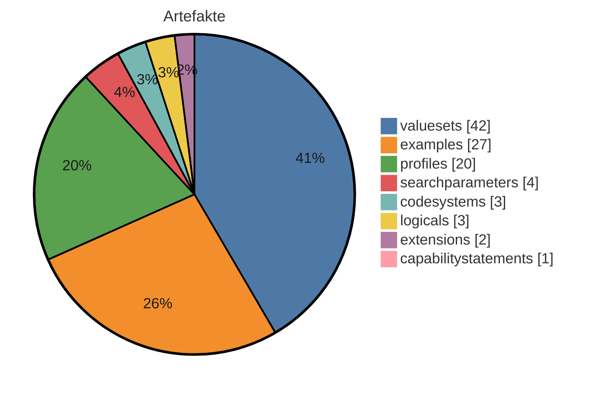
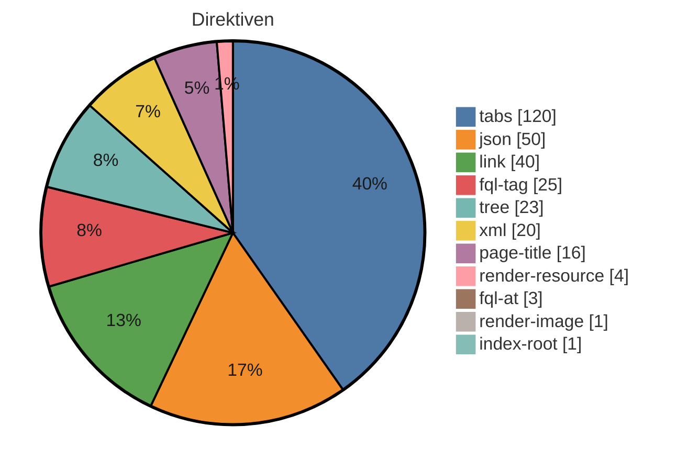

# IG-Statistik — mikrobiologie-source-2027.0.0-alpha.6

_Modus: `static` · Stand: 2026-08-25T14:43:39Z · Commit: `fdf3190`_

## Kennzahlen-Überblick

### Artefakte (Σ 102 publiziert)

_Hier wird gezählt, wie viele FHIR-Bausteine (Profile, Extensions, ValueSets usw.) der IG je Typ definiert._

<div align="center">



</div>

<div align="center">

| Typ | Anzahl |
|---|---|
| valuesets | 42 |
| examples | 27 |
| profiles | 20 |
| searchparameters | 4 |
| codesystems | 3 |
| logicals | 3 |
| extensions | 2 |
| capabilitystatements | 1 |

</div>

_Interne FSH-Konstrukte (nicht in Σ): 5 rulesets, 1 invariants._

### Plattform-Direktiven — Σ 303 (unbekannt: 0)

_Dieser Abschnitt listet die plattformspezifischen Platzhalter in den Erklärseiten, die ein generischer IG Publisher nicht versteht und die daher umgesetzt werden müssen._

<div align="center">



</div>

<div align="center">

| Direktive | Anzahl |
|---|---|
| tabs | 120 |
| json | 50 |
| link | 40 |
| fql-tag | 25 |
| tree | 23 |
| xml | 20 |
| page-title | 16 |
| render-resource | 4 |
| fql-at | 3 |
| render-image | 1 |
| index-root | 1 |

</div>

## Inhaltsumfang & Repo-Hygiene

_Linguistische Kennzahlen zum Textumfang (Wörter je Seite, Durchschnitt) sowie Hinweise auf inhaltliche Dopplungen und nicht referenzierte Dateien (Dead-Code-Analogie) - hilft, Umfang und Aufräumpotenzial einzuschätzen._

<div align="center">

| Kennzahl | Wert |
|---|---|
| Inhalts-Seiten | 40 |
| Wörter gesamt | 11357 |
| Ø Wörter / Seite | 283,9 |
| Median Wörter / Seite | 81 |
| kürzeste / längste Seite | 20 / 6274 Wörter |
| doppelte Inhaltsblöcke | 3 |
| identische Seiten (Gruppen) | 0 |
| Bilder nicht referenziert | 0 von 2 |
| Beispiele nicht in Narrativen | 0 von 27 |

</div>

_Heuristik: 'nicht referenziert' = Dateiname/Artefaktname kommt in keiner Erklärseite vor. Kein Beweis für Ungenutztheit (Referenz kann über Konfiguration/Build erfolgen)._

## Reife-Komponenten (gezählt)

_Gezählte Reife-Komponenten nebeneinander: Status, Vollständigkeit der Dokumentation, Beispiel-Abdeckung der Profile und Governance-Merkmale. Bewusst kein verdichteter Score und kein Freigabe-Urteil — die Einordnung bleibt menschlich._

<div align="center">

| Komponente | Wert |
|---|---|
| Status | active |
| Doku-Vollständigkeit (Inhalt vs. Stubs) | 93 % |
| Beispiel-Abdeckung Profile | 100 % (20/20) |
| Governance (CI · ig.ini · publication · devcontainer) | 25/100 |

</div>

## Strategie: Wiederverwendung, Lock-in & Zukunftssicherheit

_Strategische Kennzahlen: Bindung an die Quellplattform (Lock-in), Anteil standardisierter Terminologie, Wiederverwendung externer Bausteine und Zukunftssicherheit (FHIR-Version, Pflege-Aktivität)._

<div align="center">

| Kennzahl | Wert |
|---|---|
| Hersteller-Lock-in | 91/100 (hoch) · 7,6 Direktiven/Seite |
| Standard-Terminologie-Anteil | 100 % (SNOMED CT, LOINC, UCUM) |
| Wiederverwendung externer Profile (Parents) | 95 % (20 von 21 Profil-Parents extern; abstrakte LM-Basistypen ausgeschlossen) |
| FHIR-Version | R4 — aktuell verbreitet |
| Dependency-Veraltung | 0 veraltet (Heuristik) |
| Pflege-Kadenz | 55.9 Commits/Jahr · letzter Commit vor 0 Tagen |

</div>

_Lock-in und Standard-Terminologie-Anteil sind grobe Heuristiken aus Textvorkommen. Heuristik aus CalVer-Jahr; exakt nur via Package-Registry (extern)._

## Risiko & Compliance

_Entscheidungsrelevante Risiken für die Freigabe: Terminologie-Lizenzen, unterdrückte Warnungen, Datenschutz-Substanz, Wissenskonzentration (Bus-Faktor) und Kompatibilitätsbruch zur Vorversion._

<div align="center">

| Risiko | Bewertung |
|---|---|
| Terminologie-Lizenz | Lizenzbedarf möglich — SNOMED CT: lizenzpflichtig (Affiliate/Land), LOINC: frei (Registrierung), UCUM: frei |
| Unterdrückte QA-Warnungen | 0 (davon 0 breit) → keine |
| Datenschutz-Seite (Substanz) | fehlt/nur Stub (0 Wörter) |
| PII-artige Beispieldaten | keine erkannt |
| Bus-Faktor (Wissenskonzentration) | 90 % Top-Autor → hoch |
| Breaking-Change-Risiko ggü. Vorversion | — (nur per Build/Vorversions-Diff) |

</div>

## Befunde & Einordnung

_Je Themenbereich der gemessene Befund und eine neutrale Einordnung, was er über den Guide aussagt — keine Handlungs- oder Migrationsanweisungen._

<div align="center">

| Bereich | Befund | Einordnung |
|---|---|---|
| Artefakte (FSH) | 102 publiziert, FSH vorhanden | Zählt die publizierten Konformitätsressourcen und ob FSH-Quelltext vorliegt. FSH-Quellen machen den Bestand direkt les-, diff- und weiterverarbeitbar; ohne sie ist nur das generierte JSON/XML die Quelle. |
| Narrative | 40 Inhalts-Seiten, Format source | Anzahl und Format der Erklärseiten (source = Plattformformat, target = IG-Publisher-Format). Das Format bestimmt, welche Werkzeuge die Seiten unverändert verarbeiten können. |
| Direktiven | 303 (0 unbekannt) | Vorkommen plattformspezifischer Platzhalter/Tags, die nur die Quellplattform interpretiert. Je mehr davon, desto stärker ist die Darstellung an die Plattform gebunden (vgl. Lock-in-Kennzahl). |
| Dependencies | 1 (0 floating) | Deklarierte Paket-Abhängigkeiten und ihr Pinning. Floating-Einträge folgen automatisch neuen Versionen und machen Builds weniger reproduzierbar — der Wert zeigt, wie reproduzierbar der aktuelle Stand ist. |
| Mehrsprachigkeit | FSH-Übersetzung nein, Supplements 0 | Ob Übersetzungen in den FSH-Quellen (translation-Extensions) und/oder als Publisher-Supplements vorliegen. Die beiden Mechanismen decken unterschiedliche Textarten ab; der Wert zeigt den vorhandenen Stand, nicht den Bedarf. |
| Pflichtseiten | 0/13 im Zielformat | Wie viele Seiten des hinterlegten Pflicht-Rasters (mandatory_pages in dieser Datei) im Zielformat existieren. Die Aussagekraft hängt vom Raster ab: Nutzt ein Guide legitim ein anderes Seitenraster, wird das Raster korrigiert — nicht die Seiten als fehlend gewertet. |
| QC-Regeln | 8 definiert | Anzahl der im Projekt definierten Qualitätsregeln (qc/custom.rules.yaml). Statisch wird nur die Definition gezählt; Verletzungen zeigt erst der Qualitätslauf eines Builds. |
| Metadaten/Config | id kerndatensatzmodul-mikrobiologie, v2027.0.0-alpha.6 | Kern-Identität (id, Version) wie in sushi-config.yaml/package.json deklariert; die vollständigen Identitätsfelder stehen im Anhang. |

</div>

## Direktiven-Mapping (Detail)

_Dieser Abschnitt ordnet jedem Direktiven-Typ sein dokumentiertes Standard-Gegenstück im IG-Publisher-Format zu — eine Faktenreferenz, kein Arbeitsauftrag; sortiert nach Häufigkeit._

<div align="center">

| Direktive | Anzahl | Was es tut | Standard-Gegenstück (IG Publisher) |
|---|---|---|---|
| tabs | 120 | Gruppiert mehrere Inhalte (z.B. Darstellung, XML, JSON) in umschaltbare Reiter. | Die einzelnen Reiterinhalte durch die jeweils passenden generierten Anzeige-Fragmente (Struktur, XML, JSON) ersetzen; eine eigene Reiter-Mechanik ist meist nicht nötig. |
| json | 50 | Zeigt eine Ressource oder ein Beispiel in JSON-Darstellung an. | Durch das vom IG Publisher erzeugte JSON-Anzeige-Fragment ersetzen. |
| link | 40 | Erzeugt einen Verweis auf ein einzelnes Artefakt (z.B. dessen Übersichtsseite). | Durch einen normalen Markdown-Link auf die generierte Artefaktseite ersetzen (Form Typ-id.html). |
| fql-tag | 25 | Öffnet einen Abfrageblock, der eine Tabelle aus FHIR-Inhalten erzeugt. | Bei Elementtabellen eines Profils durch das vorgefertigte Element-Wörterbuch-Fragment ersetzen; reine Metadaten (URL, Status, Version) entfallen (im generierten Kopfbereich vorhanden); sonst statische oder vorlagenbasierte Tabelle. |
| tree | 23 | Zeigt die Struktur eines Profils/einer Extension als aufklappbaren Strukturbaum an. | Durch das vom IG Publisher erzeugte Struktur-Fragment ersetzen (Snapshot- oder Differential-Ansicht bzw. Element-Wörterbuch). |
| xml | 20 | Zeigt eine Ressource oder ein Beispiel in XML-Darstellung an. | Durch das vom IG Publisher erzeugte XML-Anzeige-Fragment ersetzen. |
| page-title | 16 | Setzt an dieser Stelle den Titel der Seite, der aus den Seiteneinstellungen gezogen wird. | Entfällt ersatzlos - Seitentitel und Überschrift steuert man zentral über die Seiten- und Menükonfiguration. |
| render-resource | 4 | Rendert eine vollständige FHIR-Ressource (z.B. ein CapabilityStatement) in die Seite hinein. | Meist entfernen, da der IG Publisher für jedes Artefakt automatisch eine eigene Seite erzeugt; alternativ das passende vorgefertigte Anzeige-Fragment einbinden. |
| fql-at | 3 | Markiert einen Abfrage-Codeblock in besonderer Schreibweise (mit @-Präfix). | Wie einen normalen Abfrageblock behandeln und durch ein generiertes Tabellen-Fragment oder eine statische Tabelle ersetzen. |
| render-image | 1 | Bindet ein Bild bzw. eine Grafik in die Seite ein. | Das Bild in das Bilderverzeichnis des Ziel-IG (input/images/) legen und über ein normales Markdown- oder HTML-Bild einbinden. |
| index-root | 1 | Erzeugt an dieser Stelle ein automatisches Inhaltsverzeichnis bzw. die Wurzel der Navigationsstruktur. | Entfällt - Navigation und Inhaltsverzeichnis erzeugt der IG Publisher selbst aus der konfigurierten Seitenstruktur. |

</div>

# Anhang: Detailaufschlüsselung

_Im Anhang steht jeder Einzelwert mit seiner Quelle, damit man die Kennzahlen nachvollziehen kann, ohne im Projekt suchen zu müssen._

## Identität & Herkunft

<div align="center">

| Feld | Wert | Quelle |
|---|---|---|
| id | kerndatensatzmodul-mikrobiologie | sushi-config.yaml / package.json |
| canonical | https://www.medizininformatik-initiative.de/fhir/modul-mikrobio | sushi-config.yaml / package.json |
| packageId | project | sushi-config.yaml / package.json |
| name | Kerndatensatzmodul Mikrobiologie | sushi-config.yaml / package.json |
| title |  | sushi-config.yaml / package.json |
| version | 2027.0.0-alpha.6 | sushi-config.yaml / package.json |
| status | active | sushi-config.yaml / package.json |
| fhirVersion | 4.0.1 | sushi-config.yaml / package.json |
| license |  | sushi-config.yaml / package.json |
| publisher |  | sushi-config.yaml / package.json |
| calver | True | version-Regex |

</div>

## Dependencies

_Die FHIR-Pakete, auf denen der IG aufbaut, samt Version und ob diese fest oder offen angegeben ist._

<div align="center">

| Package | Version | Pin |
|---|---|---|
| de.medizininformatikinitiative.kerndatensatz.laborbefund | 2026.0.3 | gepinnt |

</div>

## Pre-flight (Migration Gate 0)

- Lizenz-Evidenz: **KEINE — in keiner Quelle deklariert**

- Canonical-Raum: 1 außerhalb + 6 id/url-abweichend → special-url-Prognose: 7

- Dependency-Gesundheit: old-style=keine; THO direkt gepinnt=False, Extensions-Pack=False — **Injektionsrisiko: der Publisher lädt zur Buildzeit das JEWEILS NEUESTE Release**; externe Parents: 2

- QA-Baseline: **keine im Baum** — für Vorher/Nachher-Beweise die unmigrierte Quelle bauen oder deren gerendertes qa beziehen

## Artefakte (Quelle: input/fsh (FSH-Deklarationen))

_Jedes definierte Artefakt mit Typ, Name und Fundort in den Quelldateien._

<div align="center">

| Typ | Name | InstanceOf | Quelle |
|---|---|---|---|
| CodeSystem | MII_CS_Mikrobio_MRGN_Ergebnis |  | input/fsh/codesystems/MII_CS_Mikrobio_MRGN_Ergebnis.fsh:1 |
| CodeSystem | MII_CS_Mikrobio_Resistenzkategorie |  | input/fsh/codesystems/MII_CS_Mikrobio_Resistenzkategorie.fsh:1 |
| CodeSystem | MII_CS_Mikrobio_Susceptibility_NORM |  | input/fsh/codesystems/MII_CS_Mikrobio_Susceptibility_Norm.fsh:1 |
| Extension | ExtensionObservation_TriggeredBy |  | input/fsh/extensions/ExtensionObservation_TriggeredBy.fsh:5 |
| Extension | MII_EX_Mikrobio_Empfindlichkeit_Norm |  | input/fsh/extensions/MII_EX_Mikrobio_Empfindlichkeit_Norm.fsh:1 |
| Instance | MII-CPS-Metadata-Mikrobio | CapabilityStatement | input/fsh/instances/MII-CPS-Metadata-Mikrobio.fsh:1 |
| Instance | mii-exa-mikrobio-allgemeine-bestimmung | MII_PR_Mikrobio_Allgemeine_Bestimmung | input/fsh/instances/mii-exa-mikrobio-allgemeine-bestimmung.fsh:1 |
| Instance | mii-exa-mikrobio-allgemeine-kultur | MII_PR_Mikrobio_Allgemeine_Kultur | input/fsh/instances/mii-exa-mikrobio-allgemeine-kultur.fsh:1 |
| Instance | mii-exa-mikrobio-antigen-antikoerper-quantitativ | MII_PR_Mikrobio_Antigen_Antikoerper_Quantitativ | input/fsh/instances/mii-exa-mikrobio-antigen-antikoerper-quantitativ.fsh:1 |
| Instance | mii-exa-mikrobio-aviditaet | MII_PR_Mikrobio_Aviditaet | input/fsh/instances/mii-exa-mikrobio-aviditaet.fsh:1 |
| Instance | mii-exa-mikrobio-barlett-score | MII_PR_Mikrobio_Barlett_Score | input/fsh/instances/mii-exa-mikrobio-barlett-score.fsh:1 |
| Instance | mii-exa-mikrobio-ct-wert | MII_PR_Mikrobio_Ct_Wert | input/fsh/instances/mii-exa-mikrobio-ct-wert.fsh:1 |
| Instance | mii-exa-mikrobio-diagnostic-report | MII_PR_Mikrobio_Diagnostic_Report | input/fsh/instances/mii-exa-mikrobio-diagnostic-report.fsh:1 |
| Instance | mii-exa-mikrobio-empfindlichkeit | MII_PR_Mikrobio_Empfindlichkeit | input/fsh/instances/mii-exa-mikrobio-empfindlichkeit.fsh:1 |
| Instance | mii-exa-mikrobio-keimzahl | MII_PR_Mikrobio_Keimzahl | input/fsh/instances/mii-exa-mikrobio-keimzahl.fsh:1 |
| Instance | mii-exa-mikrobio-mikroskopie | MII_PR_Mikrobio_Mikroskopie | input/fsh/instances/mii-exa-mikrobio-mikroskopie.fsh:1 |
| Instance | mii-exa-mikrobio-molekulare-pathogenlast | MII_PR_Mikrobio_Molekulare_Pathogenlast | input/fsh/instances/mii-exa-mikrobio-molekulare-pathogenlast.fsh:1 |
| Instance | mii-exa-mikrobio-mrgn-klasse-negativ | MII_PR_Mikrobio_MRGN_Klasse | input/fsh/instances/mii-exa-mikrobio-mrgn-klasse-negativ.fsh:7 |
| Instance | mii-exa-mikrobio-mrgn-klasse | MII_PR_Mikrobio_MRGN_Klasse | input/fsh/instances/mii-exa-mikrobio-mrgn-klasse.fsh:1 |
| Instance | mii-exa-mikrobio-nugent-score | MII_PR_Mikrobio_Nugent_Score | input/fsh/instances/mii-exa-mikrobio-nugent-score.fsh:1 |
| Instance | mii-exa-mikrobio-resistenzkategorie-vre-negativ | MII_PR_Mikrobio_Resistenzkategorie_Status | input/fsh/instances/mii-exa-mikrobio-resistenzkategorie-vre-negativ.fsh:7 |
| Instance | mii-exa-mikrobio-resistenzkategorie-vre-positiv | MII_PR_Mikrobio_Resistenzkategorie_Status | input/fsh/instances/mii-exa-mikrobio-resistenzkategorie-vre-positiv.fsh:10 |
| Instance | mii-exa-mikrobio-resistenzmechanismen-determinanten | MII_PR_Mikrobio_Resistenzmechanismen_Determinanten | input/fsh/instances/mii-exa-mikrobio-resistenzmechanismen-determinanten.fsh:1 |
| Instance | mii-exa-mikrobio-spezifische-bestimmung-vre-negativ | MII_PR_Mikrobio_Spezifische_Bestimmung | input/fsh/instances/mii-exa-mikrobio-spezifische-bestimmung-vre-negativ.fsh:8 |
| Instance | mii-exa-mikrobio-spezifische-bestimmung | MII_PR_Mikrobio_Spezifische_Bestimmung | input/fsh/instances/mii-exa-mikrobio-spezifische-bestimmung.fsh:1 |
| Instance | mii-exa-mikrobio-spezifische-kultur-vre-negativ | MII_PR_Mikrobio_Spezifische_Kultur | input/fsh/instances/mii-exa-mikrobio-spezifische-kultur-vre-negativ.fsh:4 |
| Instance | mii-exa-mikrobio-spezifische-kultur | MII_PR_Mikrobio_Spezifische_Kultur | input/fsh/instances/mii-exa-mikrobio-spezifische-kultur.fsh:1 |
| Instance | mii-exa-mikrobio-titer | MII_PR_Mikrobio_Titer | input/fsh/instances/mii-exa-mikrobio-titer.fsh:1 |
| Instance | mii-exa-mikrobio-virulenzfaktor | MII_PR_Mikrobio_Virulenzfaktor | input/fsh/instances/mii-exa-mikrobio-virulenzfaktor.fsh:1 |
| Instance | mii-exa-mikrobio-voraussichtliche-empfindlichkeit | MII_PR_Mikrobio_Voraussichtliche_Empfindlichkeit | input/fsh/instances/mii-exa-mikrobio-voraussichtliche-empfindlichkeit.fsh:1 |
| Instance | mii-exa-mikrobio-workflow-vre-01-kultur | MII_PR_Mikrobio_Spezifische_Kultur | input/fsh/instances/mii-exa-mikrobio-workflow-vre-01-kultur.fsh:17 |
| Instance | mii-exa-mikrobio-workflow-vre-02-identifikation | MII_PR_Mikrobio_Allgemeine_Bestimmung | input/fsh/instances/mii-exa-mikrobio-workflow-vre-02-identifikation.fsh:10 |
| Instance | mii-exa-mikrobio-workflow-vre-03-empfindlichkeit | MII_PR_Mikrobio_Empfindlichkeit | input/fsh/instances/mii-exa-mikrobio-workflow-vre-03-empfindlichkeit.fsh:5 |
| Instance | mii-sp-mikrobio-interpretation | SearchParameter | input/fsh/instances/mii-sp-mikrobio-interpretation.fsh:1 |
| Logical | MII_LM_Mikrobio_Befund |  | input/fsh/logicals/MII_LM_Mikrobio_Befund.fsh:3 |
| Logical | MII_LM_Mikrobio_Untersuchung |  | input/fsh/logicals/MII_LM_Mikrobio_Untersuchung.fsh:5 |
| Logical | MII_LM_Mikrobio_Untersuchungsarten |  | input/fsh/logicals/MII_LM_Mikrobio_Untersuchungsarten.fsh:4 |
| Profile | MII_PR_Mikrobio_Allgemeine_Bestimmung |  | input/fsh/profiles/MII_PR_Mikrobio_Allgemeine_Bestimmung.fsh:1 |
| Profile | MII_PR_Mikrobio_Allgemeine_Kultur |  | input/fsh/profiles/MII_PR_Mikrobio_Allgemeine_Kultur.fsh:1 |
| Profile | MII_PR_Mikrobio_Antigen_Antikoerper_Quantitativ |  | input/fsh/profiles/MII_PR_Mikrobio_Antigen_Antikoerper_Quantitativ.fsh:1 |
| Profile | MII_PR_Mikrobio_Aviditaet |  | input/fsh/profiles/MII_PR_Mikrobio_Aviditaet.fsh:1 |
| Profile | MII_PR_Mikrobio_Barlett_Score |  | input/fsh/profiles/MII_PR_Mikrobio_Barlett_Score.fsh:1 |
| Profile | MII_PR_Mikrobio_Ct_Wert |  | input/fsh/profiles/MII_PR_Mikrobio_Ct_Wert.fsh:1 |
| Profile | MII_PR_Mikrobio_Diagnostic_Report |  | input/fsh/profiles/MII_PR_Mikrobio_Diagnostic_Report.fsh:1 |
| Profile | MII_PR_Mikrobio_Empfindlichkeit |  | input/fsh/profiles/MII_PR_Mikrobio_Empfindlichkeit.fsh:1 |
| Profile | MII_PR_Mikrobio_Keimzahl |  | input/fsh/profiles/MII_PR_Mikrobio_Keimzahl.fsh:1 |
| Profile | MII_PR_Mikrobio_MRGN_Klasse |  | input/fsh/profiles/MII_PR_Mikrobio_MRGN_Klasse.fsh:1 |
| Profile | MII_PR_Mikrobio_Mikroskopie |  | input/fsh/profiles/MII_PR_Mikrobio_Mikroskopie.fsh:1 |
| Profile | MII_PR_Mikrobio_Molekulare_Pathogenlast |  | input/fsh/profiles/MII_PR_Mikrobio_Molekulare_Pathogenlast.fsh:1 |
| Profile | MII_PR_Mikrobio_Nugent_Score |  | input/fsh/profiles/MII_PR_Mikrobio_Nugent_Score.fsh:1 |
| Invariant | nugent-score-0-to-10 |  | input/fsh/profiles/MII_PR_Mikrobio_Nugent_Score.fsh:15 |
| Profile | MII_PR_Mikrobio_Resistenzkategorie_Status |  | input/fsh/profiles/MII_PR_Mikrobio_Resistenzkategorie_Status.fsh:1 |
| Profile | MII_PR_Mikrobio_Resistenzmechanismen_Determinanten |  | input/fsh/profiles/MII_PR_Mikrobio_Resistenzmechanismen_Determinanten.fsh:1 |
| Profile | MII_PR_Mikrobio_Spezifische_Bestimmung |  | input/fsh/profiles/MII_PR_Mikrobio_Spezifische_Bestimmung.fsh:1 |
| Profile | MII_PR_Mikrobio_Spezifische_Kultur |  | input/fsh/profiles/MII_PR_Mikrobio_Spezifische_Kultur.fsh:1 |
| Profile | MII_PR_Mikrobio_Titer |  | input/fsh/profiles/MII_PR_Mikrobio_Titer.fsh:1 |
| Profile | MII_PR_Mikrobio_Virulenzfaktor |  | input/fsh/profiles/MII_PR_Mikrobio_Virulenzfaktor.fsh:1 |
| Profile | MII_PR_Mikrobio_Voraussichtliche_Empfindlichkeit |  | input/fsh/profiles/MII_PR_Mikrobio_Voraussichtliche_Empfindlichkeit.fsh:1 |
| RuleSet | MIKRO_OBSERVATION_COMMON |  | input/fsh/rulesets/mikrobio-observation-common.fsh:1 |
| RuleSet | Publisher |  | input/fsh/rulesets/publisher.fsh:1 |
| RuleSet | SP_Publisher |  | input/fsh/rulesets/publisher.fsh:6 |
| RuleSet | Version |  | input/fsh/rulesets/version.fsh:2 |
| RuleSet | PR_CS_VS_Version |  | input/fsh/rulesets/version.fsh:5 |
| Instance | ObservationInterpretation | SearchParameter | input/fsh/searchparameter/MII_SP_Mikrobio_Observation-interpretation.fsh:1 |
| Instance | mii-sp-mikrobio-observation-titer | SearchParameter | input/fsh/searchparameter/MII_SP_Mikrobio_Observation-titer.fsh:8 |
| Instance | mii-sp-mikrobio-observation-triggered-by | SearchParameter | input/fsh/searchparameter/MII_SP_Mikrobio_Observation-triggered-by.fsh:1 |
| ValueSet | MII_VS_Labor_Laborergebnis_Semiquantitativ |  | input/fsh/valuesets/MII_VS_Labor_Laborergbenis_Semiquantitativ_SNOMED.fsh:1 |
| ValueSet | MII_VS_Mikrobio_Allgemeine_Bestimmung_Ergebnis_SNOMED |  | input/fsh/valuesets/MII_VS_Mikrobio_Allgemeine_Bestimmung_Ergebnis_SNOMED.fsh:1 |
| ValueSet | MII_VS_Mikrobio_Allgemeine_Bestimmung_Methode_SNOMED |  | input/fsh/valuesets/MII_VS_Mikrobio_Allgemeine_Bestimmung_Methode_SNOMED.fsh:1 |
| ValueSet | MII_VS_Mikrobio_Allgemeine_Kultur_Methode_SNOMED |  | input/fsh/valuesets/MII_VS_Mikrobio_Allgemeine_Kultur_Methode_SNOMED.fsh:1 |
| ValueSet | MII_VS_Mikrobio_Antigen_Antikoerper_Methode_SNOMED |  | input/fsh/valuesets/MII_VS_Mikrobio_Antigen_Antikoerper_Methode_SNOMED.fsh:1 |
| ValueSet | MII_VS_Mikrobio_Antigen_Antikoerper_Quantitativ_Einheiten_UCUM |  | input/fsh/valuesets/MII_VS_Mikrobio_Antigen_Antikoerper_Quantitativ_Einheiten_UCUM.fsh:1 |
| ValueSet | MII_VS_Mikrobio_Antigen_Antikoerper_Quantitative_Tests_LOINC |  | input/fsh/valuesets/MII_VS_Mikrobio_Antigen_Antikoerper_Quantitative_Tests_LOINC.fsh:1 |
| ValueSet | MII_VS_Mikrobio_Aviditaet_Ergebnis |  | input/fsh/valuesets/MII_VS_Mikrobio_Aviditaet_Ergebnis_SNOMED.fsh:1 |
| ValueSet | MII_VS_Mikrobio_Aviditaet_Tests_LOINC |  | input/fsh/valuesets/MII_VS_Mikrobio_Aviditaet_Tests_LOINC.fsh:1 |
| ValueSet | MII_VS_Mikrobio_Barlett_Score_LOINC |  | input/fsh/valuesets/MII_VS_Mikrobio_Barlett_Score_LOINC.fsh:1 |
| ValueSet | MII_VS_Mikrobio_Befundtyp_LOINC |  | input/fsh/valuesets/MII_VS_Mikrobio_Befundtyp_LOINC.fsh:1 |
| ValueSet | MII_VS_Mikrobio_CT_Wert_LOINC |  | input/fsh/valuesets/MII_VS_Mikrobio_CT_Wert_LOINC.fsh:1 |
| ValueSet | MII_VS_Mikrobio_Data_Absent_Reason |  | input/fsh/valuesets/MII_VS_Mikrobio_Data_Absent_Reason.fsh:1 |
| ValueSet | MII_VS_Mikrobio_Detected_Not_Detected_SNOMED |  | input/fsh/valuesets/MII_VS_Mikrobio_Detected_Not_Detected_SNOMED.fsh:1 |
| ValueSet | MII_VS_Mikrobio_Empfindlichkeit_Einheiten_UCUM |  | input/fsh/valuesets/MII_VS_Mikrobio_Empfindlichkeit_Einheiten_UCUM.fsh:1 |
| ValueSet | MII_VS_Mikrobio_Empfindlichkeit_Phenotyp_LOINC |  | input/fsh/valuesets/MII_VS_Mikrobio_Empfindlichkeit_Phenotyp_LOINC.fsh:1 |
| ValueSet | MII_VS_Mikrobio_Empfaenglichkeit_Genotyp_LOINC |  | input/fsh/valuesets/MII_VS_Mikrobio_Empfänglichkeit_Genotyp_LOINC.fsh:1 |
| ValueSet | MII_VS_Mikrobio_Keimzahl_Einheiten_UCUM |  | input/fsh/valuesets/MII_VS_Mikrobio_Keimzahl_Einheiten_UCUM.fsh:1 |
| ValueSet | MII_VS_Mikrobio_Keimzahl_LOINC |  | input/fsh/valuesets/MII_VS_Mikrobio_Keimzahl_LOINC.fsh:1 |
| ValueSet | MII_VS_Mikrobio_Kultur_Ergebnis_SNOMED |  | input/fsh/valuesets/MII_VS_Mikrobio_Kultur_Ergebnis_SNOMED.fsh:1 |
| ValueSet | MII_VS_Mikrobio_MRGN_Klasse_LOINC |  | input/fsh/valuesets/MII_VS_Mikrobio_MRGN_Klasse_LOINC.fsh:1 |
| ValueSet | MII_VS_Mikrobio_Molekulare_Diagnostik_Einheiten_UCUM |  | input/fsh/valuesets/MII_VS_Mikrobio_Molekulare_Diagnostik_Einheiten_UCUM.fsh:1 |
| ValueSet | MII_VS_Mikrobio_Molekulare_Pathogenlast_Methode_SNOMED |  | input/fsh/valuesets/MII_VS_Mikrobio_Molekulare_Pathogenlast_Methode_SNOMED.fsh:1 |
| ValueSet | MII_VS_Mikrobio_Molekulare_Pathogenlast_Tests_LOINC |  | input/fsh/valuesets/MII_VS_Mikrobio_Molekulare_Pathogenlast_Tests_LOINC.fsh:1 |
| ValueSet | MII_VS_Mikrobio_Morphologie_Ergebnis_SNOMED |  | input/fsh/valuesets/MII_VS_Mikrobio_Morphologie_Ergebnis_SNOMED.fsh:1 |
| ValueSet | MII_VS_Mikrobio_Morphologie_Methode_SNOMED |  | input/fsh/valuesets/MII_VS_Mikrobio_Morphologie_Methode_SNOMED.fsh:1 |
| ValueSet | MII_VS_Mikrobio_Organismen_SNOMEDCT |  | input/fsh/valuesets/MII_VS_Mikrobio_Organismen_SNOMEDCT.fsh:1 |
| ValueSet | MII_VS_Mikrobio_Resistenzkategorie_Status |  | input/fsh/valuesets/MII_VS_Mikrobio_Resistenzkategorie_Status.fsh:1 |
| ValueSet | MII_VS_Mikrobio_Resistenzkategorie_Status_Ergebnis |  | input/fsh/valuesets/MII_VS_Mikrobio_Resistenzkategorie_Status_Ergebnis.fsh:1 |
| ValueSet | MII_VS_Mikrobio_Resistenzmechanismen_Determinanten_LOINC |  | input/fsh/valuesets/MII_VS_Mikrobio_Resistenzmechanismen_Determinanten_LOINC.fsh:1 |
| ValueSet | MII_VS_Mikrobio_Resistenzmechanismen_Methode_SNOMED |  | input/fsh/valuesets/MII_VS_Mikrobio_Resistenzmechanismen_Methode_SNOMED.fsh:1 |
| ValueSet | MII_VS_Mikrobio_Spezifische_Bestimmung_Ergebnis_SNOMED |  | input/fsh/valuesets/MII_VS_Mikrobio_Spezifische_Bestimmung_Ergebnis_SNOMED.fsh:1 |
| ValueSet | MII_VS_Mikrobio_Spezifische_Bestimmung_Methode_SNOMED |  | input/fsh/valuesets/MII_VS_Mikrobio_Spezifische_Bestimmung_Methode_SNOMED.fsh:1 |
| ValueSet | MII_VS_Mikrobio_Spezifische_Bestimmung_Tests_LOINC |  | input/fsh/valuesets/MII_VS_Mikrobio_Spezifische_Bestimmung_Tests_LOINC.fsh:1 |
| ValueSet | MII_VS_Mikrobio_Spezifische_Kultur_Methode_SNOMED |  | input/fsh/valuesets/MII_VS_Mikrobio_Spezifische_Kultur_Methode_SNOMED.fsh:1 |
| ValueSet | MII_VS_Mikrobio_Spezifische_Kultur_Tests_LOINC |  | input/fsh/valuesets/MII_VS_Mikrobio_Spezifische_Kultur_Tests_LOINC.fsh:1 |
| ValueSet | MII_VS_Mikrobio_Susceptibility |  | input/fsh/valuesets/MII_VS_Mikrobio_Susceptibility.fsh:1 |
| ValueSet | MII_VS_Mikrobio_Susceptibility_NORM |  | input/fsh/valuesets/MII_VS_Mikrobio_Susceptibility_NORM.fsh:1 |
| ValueSet | MII_VS_Mikrobio_Titer_Methode_SNOMED |  | input/fsh/valuesets/MII_VS_Mikrobio_Titer_Methode_SNOMED.fsh:1 |
| ValueSet | MII_VS_Mikrobio_Titer_Tests_LOINC |  | input/fsh/valuesets/MII_VS_Mikrobio_Titer_Tests_LOINC.fsh:1 |
| ValueSet | MII_VS_Mikrobio_Virulenz_LOINC |  | input/fsh/valuesets/MII_VS_Mikrobio_Virulenz_LOINC.fsh:1 |
| ValueSet | MII_VS_Mikrobio_Voraussichtliche_Empfindlichkeit |  | input/fsh/valuesets/MII_VS_Mikrobio_Voraussichtliche_Empfindlichkeit_SNOMEDCT.fsh:1 |

</div>

## Narrative-Seiten (40 Inhalt / 43 gesamt)

_Die Erklärseiten des IG mit Umfang und der Angabe, ob es sich um Inhalts- oder reine Platzhalterseiten handelt._

<div align="center">

| Datei | Wörter | Format | Stub? |
|---|---|---|---|
| implementation-guides/modulmikrobio-2027/MIIIGModulMikrobiologie/Changelog.page.md | 6274 | source |  |
| implementation-guides/modulmikrobio-2027/MIIIGModulMikrobiologie/Technische-Implementierung/Profilauswahl-und-Abgrenzung.page.md | 746 | source |  |
| implementation-guides/modulmikrobio-2027/MIIIGModulMikrobiologie/Technische-Implementierung/FHIR-Profile/Weitere-Eigenschaften/Resistenzkategorie-Status.page.md | 460 | source |  |
| implementation-guides/modulmikrobio-2027/MIIIGModulMikrobiologie/Index.page.md | 387 | source |  |
| implementation-guides/modulmikrobio-2027/MIIIGModulMikrobiologie/Anwendungsfaelle-Informationsmodell/Datensaetze-inkl-Beschreibungen.page.md | 276 | source |  |
| implementation-guides/modulmikrobio-2027/MIIIGModulMikrobiologie/Technische-Implementierung/FHIR-Profile/Diagnostic-Report.page.md | 229 | source |  |
| implementation-guides/modulmikrobio-2027/MIIIGModulMikrobiologie/Technische-Implementierung/FHIR-Profile/Bestimmung/Spezifische-Bestimmung.page.md | 207 | source |  |
| implementation-guides/modulmikrobio-2027/MIIIGModulMikrobiologie/Technische-Implementierung/FHIR-Profile/Bestimmung/Allgemeine-Bestimmung.page.md | 182 | source |  |
| implementation-guides/modulmikrobio-2027/MIIIGModulMikrobiologie/Technische-Implementierung/FHIR-Profile/Weitere-Eigenschaften/MRGN-Klasse.page.md | 169 | source |  |
| implementation-guides/modulmikrobio-2027/MIIIGModulMikrobiologie/Technische-Implementierung/FHIR-Profile/Quantitative-tests/Titer.page.md | 162 | source |  |
| implementation-guides/modulmikrobio-2027/MIIIGModulMikrobiologie/Technische-Implementierung/Terminologien.page.md | 162 | source |  |
| implementation-guides/modulmikrobio-2027/MIIIGModulMikrobiologie/Technische-Implementierung/FHIR-Profile/Kultur/Spezifische-Kultur.page.md | 145 | source |  |
| implementation-guides/modulmikrobio-2027/MIIIGModulMikrobiologie/Technische-Implementierung/FHIR-Profile/Index.page.md | 135 | source |  |
| implementation-guides/modulmikrobio-2027/MIIIGModulMikrobiologie/Anwendungsfaelle-Informationsmodell/UML.page.md | 125 | source |  |
| implementation-guides/modulmikrobio-2027/MIIIGModulMikrobiologie/Technische-Implementierung/FHIR-Profile/Kultur/Empfindlichkeit.page.md | 116 | source |  |
| implementation-guides/modulmikrobio-2027/MIIIGModulMikrobiologie/Technische-Implementierung/FHIR-Profile/Probe.page.md | 110 | source |  |
| implementation-guides/modulmikrobio-2027/MIIIGModulMikrobiologie/Anwendungsfaelle-Informationsmodell/Beschreibung-von-Szenarien-fuer-die-Anwendung-der-Module.page.md | 105 | source |  |
| implementation-guides/modulmikrobio-2027/MIIIGModulMikrobiologie/Referenzen.page.md | 84 | source |  |
| implementation-guides/modulmikrobio-2027/MIIIGModulMikrobiologie/Technische-Implementierung/CapabilityStatement.page.md | 83 | source |  |
| implementation-guides/modulmikrobio-2027/MIIIGModulMikrobiologie/Kontext-im-Gesamtprojekt-Bezuege-zu-anderen-Modulen.page.md | 82 | source |  |
| implementation-guides/modulmikrobio-2027/MIIIGModulMikrobiologie/Technische-Implementierung/FHIR-Profile/Kultur/Allgemeine-Kultur.page.md | 80 | source |  |
| implementation-guides/modulmikrobio-2027/MIIIGModulMikrobiologie/Technische-Implementierung/FHIR-Profile/Kultur/Mikroskopie.page.md | 74 | source |  |
| implementation-guides/modulmikrobio-2027/MIIIGModulMikrobiologie/Technische-Implementierung/FHIR-Profile/Kultur/Barlett-Score.page.md | 73 | source |  |
| implementation-guides/modulmikrobio-2027/MIIIGModulMikrobiologie/Technische-Implementierung/FHIR-Profile/Weitere-Eigenschaften/Aviditaet.page.md | 72 | source |  |
| implementation-guides/modulmikrobio-2027/MIIIGModulMikrobiologie/Technische-Implementierung/FHIR-Profile/Quantitative-tests/Molekulare-Pathogenlast.page.md | 70 | source |  |
| implementation-guides/modulmikrobio-2027/MIIIGModulMikrobiologie/Technische-Implementierung/FHIR-Profile/Kultur/Keimzahl.page.md | 69 | source |  |
| implementation-guides/modulmikrobio-2027/MIIIGModulMikrobiologie/Technische-Implementierung/FHIR-Profile/Quantitative-tests/Antigen-Antikoerper-Quantitativ.page.md | 69 | source |  |
| implementation-guides/modulmikrobio-2027/MIIIGModulMikrobiologie/Technische-Implementierung/FHIR-Profile/Weitere-Eigenschaften/Resistenzmechanismen-Determinanten.page.md | 68 | source |  |
| implementation-guides/modulmikrobio-2027/MIIIGModulMikrobiologie/Technische-Implementierung/FHIR-Profile/Weitere-Eigenschaften/Voraussichtliche-Empfindlichkeit.page.md | 67 | source |  |
| implementation-guides/modulmikrobio-2027/MIIIGModulMikrobiologie/Technische-Implementierung/FHIR-Profile/Bestimmung/CT-Wert.page.md | 66 | source |  |
| implementation-guides/modulmikrobio-2027/MIIIGModulMikrobiologie/Technische-Implementierung/FHIR-Profile/Kultur/Nugent-Score.page.md | 65 | source |  |
| implementation-guides/modulmikrobio-2027/MIIIGModulMikrobiologie/Beschreibung-Modul-Mikrobiologie.page.md | 64 | source |  |
| implementation-guides/modulmikrobio-2027/MIIIGModulMikrobiologie/Technische-Implementierung/FHIR-Profile/Weitere-Eigenschaften/Virulenzfaktor.page.md | 64 | source |  |
| implementation-guides/modulmikrobio-2027/MIIIGModulMikrobiologie/Anwendungsfaelle-Informationsmodell/Index.page.md | 58 | source |  |
| implementation-guides/modulmikrobio-2027/MIIIGModulMikrobiologie/Technische-Implementierung/FHIR-Profile/FQL-Beschreibung.page.md | 45 | source |  |
| implementation-guides/modulmikrobio-2027/MIIIGModulMikrobiologie/Technische-Implementierung/FHIR-Profile/FQL-Capability-Search.page.md | 25 | source |  |
| implementation-guides/modulmikrobio-2027/MIIIGModulMikrobiologie/Technische-Implementierung/FHIR-Profile/FQL-Capability-Operations.page.md | 23 | source |  |
| implementation-guides/modulmikrobio-2027/MIIIGModulMikrobiologie/Technische-Implementierung/FHIR-Profile/FQL-Capability-REST.page.md | 23 | source |  |
| implementation-guides/modulmikrobio-2027/MIIIGModulMikrobiologie/Technische-Implementierung/FHIR-Profile/Kultur/Index.page.md | 23 | source |  |
| implementation-guides/modulmikrobio-2027/MIIIGModulMikrobiologie/Technische-Implementierung/FHIR-Profile/Weitere-Eigenschaften/Index.page.md | 20 | source |  |
| implementation-guides/modulmikrobio-2027/MIIIGModulMikrobiologie/Technische-Implementierung/FHIR-Profile/Quantitative-tests/Index.page.md | 13 | source | ja |
| implementation-guides/modulmikrobio-2027/MIIIGModulMikrobiologie/Technische-Implementierung/FHIR-Profile/Bestimmung/Index.page.md | 11 | source | ja |
| implementation-guides/modulmikrobio-2027/MIIIGModulMikrobiologie/Technische-Implementierung/Index.page.md | 8 | source | ja |

</div>

> Format = **source**: die Pflichtseiten existieren im Quell-Guide; „fehlende Zielseiten" wird hier daher nicht als Lücke gewertet.

## Direktiven-Fundstellen

_Jede gefundene Direktive mit genauer Fundstelle und Originaltext zur weiteren Bearbeitung._

<div align="center">

| Fundstelle | Direktive | Text (gekürzt) |
|---|---|---|
| implementation-guides/modulmikrobio-2027/MIIIGModulMikrobiologie/Anwendungsfaelle-Informationsmodell/Beschreibung-von-Szenarien-fuer-die-Anwendung-der-Module.page.md:1 | page-title | ## {{page-title}} |
| implementation-guides/modulmikrobio-2027/MIIIGModulMikrobiologie/Anwendungsfaelle-Informationsmodell/Datensaetze-inkl-Beschreibungen.page.md:1 | page-title | ## {{page-title}} |
| implementation-guides/modulmikrobio-2027/MIIIGModulMikrobiologie/Anwendungsfaelle-Informationsmodell/Datensaetze-inkl-Beschreibungen.page.md:19 | tree | {{tree:https://www.medizininformatik-initiative.de/fhir/modul-mikrobio/Structure |
| implementation-guides/modulmikrobio-2027/MIIIGModulMikrobiologie/Anwendungsfaelle-Informationsmodell/Datensaetze-inkl-Beschreibungen.page.md:21 | fql-at | @``` from StructureDefinition where url =  'https://www.medizininformatik-initia |
| implementation-guides/modulmikrobio-2027/MIIIGModulMikrobiologie/Anwendungsfaelle-Informationsmodell/Datensaetze-inkl-Beschreibungen.page.md:27 | tree | {{tree:https://www.medizininformatik-initiative.de/fhir/modul-mikrobio/Structure |
| implementation-guides/modulmikrobio-2027/MIIIGModulMikrobiologie/Anwendungsfaelle-Informationsmodell/Datensaetze-inkl-Beschreibungen.page.md:29 | fql-at | @``` from StructureDefinition where url =  'https://www.medizininformatik-initia |
| implementation-guides/modulmikrobio-2027/MIIIGModulMikrobiologie/Anwendungsfaelle-Informationsmodell/Datensaetze-inkl-Beschreibungen.page.md:35 | tree | {{tree:https://www.medizininformatik-initiative.de/fhir/modul-mikrobio/Structure |
| implementation-guides/modulmikrobio-2027/MIIIGModulMikrobiologie/Anwendungsfaelle-Informationsmodell/Datensaetze-inkl-Beschreibungen.page.md:37 | fql-at | @``` from StructureDefinition where url =  'https://www.medizininformatik-initia |
| implementation-guides/modulmikrobio-2027/MIIIGModulMikrobiologie/Anwendungsfaelle-Informationsmodell/Index.page.md:1 | page-title | ## {{page-title}} |
| implementation-guides/modulmikrobio-2027/MIIIGModulMikrobiologie/Anwendungsfaelle-Informationsmodell/UML.page.md:1 | page-title | ## {{page-title}} |
| implementation-guides/modulmikrobio-2027/MIIIGModulMikrobiologie/Anwendungsfaelle-Informationsmodell/UML.page.md:9 | render-resource | {{render:implementation-guides-modulmikrobio-2027-images-mii-mikrobio-informatio |
| implementation-guides/modulmikrobio-2027/MIIIGModulMikrobiologie/Anwendungsfaelle-Informationsmodell/UML.page.md:17 | render-resource | {{render:implementation-guides-modulmikrobio-2027-images-mii-mikrobio-untersuchu |
| implementation-guides/modulmikrobio-2027/MIIIGModulMikrobiologie/Changelog.page.md:1 | page-title | ## {{page-title}} |
| implementation-guides/modulmikrobio-2027/MIIIGModulMikrobiologie/Index.page.md:5 | render-image | \| {{render:Warning.jpg}}  \| Im Rahmen eines Harmonisierungsprozesses zwischen de |
| implementation-guides/modulmikrobio-2027/MIIIGModulMikrobiologie/Index.page.md:19 | index-root | {{index:root}} |
| implementation-guides/modulmikrobio-2027/MIIIGModulMikrobiologie/Kontext-im-Gesamtprojekt-Bezuege-zu-anderen-Modulen.page.md:1 | page-title | ## {{page-title}} |
| implementation-guides/modulmikrobio-2027/MIIIGModulMikrobiologie/Referenzen.page.md:1 | page-title | ## {{page-title}} |
| implementation-guides/modulmikrobio-2027/MIIIGModulMikrobiologie/Technische-Implementierung/CapabilityStatement.page.md:1 | page-title | ## {{page-title}} |
| implementation-guides/modulmikrobio-2027/MIIIGModulMikrobiologie/Technische-Implementierung/CapabilityStatement.page.md:11 | render-resource | {{render:https://www.medizininformatik-initiative.de/fhir/modul-mikrobio/Capabil |
| implementation-guides/modulmikrobio-2027/MIIIGModulMikrobiologie/Technische-Implementierung/FHIR-Profile/Bestimmung/Allgemeine-Bestimmung.page.md:7 | link | ## {{link}} |
| implementation-guides/modulmikrobio-2027/MIIIGModulMikrobiologie/Technische-Implementierung/FHIR-Profile/Bestimmung/Allgemeine-Bestimmung.page.md:27 | fql-tag | <fql output="table" headers="true"> |
| implementation-guides/modulmikrobio-2027/MIIIGModulMikrobiologie/Technische-Implementierung/FHIR-Profile/Bestimmung/Allgemeine-Bestimmung.page.md:38 | tabs | <tabs> |
| implementation-guides/modulmikrobio-2027/MIIIGModulMikrobiologie/Technische-Implementierung/FHIR-Profile/Bestimmung/Allgemeine-Bestimmung.page.md:39 | tree | <tab title="Darstellung">{{tree, buttons}}</tab> |
| implementation-guides/modulmikrobio-2027/MIIIGModulMikrobiologie/Technische-Implementierung/FHIR-Profile/Bestimmung/Allgemeine-Bestimmung.page.md:39 | tabs | <tab title="Darstellung">{{tree, buttons}}</tab> |
| implementation-guides/modulmikrobio-2027/MIIIGModulMikrobiologie/Technische-Implementierung/FHIR-Profile/Bestimmung/Allgemeine-Bestimmung.page.md:40 | xml | <tab title="XML">{{xml}}</tab> |
| implementation-guides/modulmikrobio-2027/MIIIGModulMikrobiologie/Technische-Implementierung/FHIR-Profile/Bestimmung/Allgemeine-Bestimmung.page.md:40 | tabs | <tab title="XML">{{xml}}</tab> |
| implementation-guides/modulmikrobio-2027/MIIIGModulMikrobiologie/Technische-Implementierung/FHIR-Profile/Bestimmung/Allgemeine-Bestimmung.page.md:41 | json | <tab title="JSON">{{json}}</tab> |
| implementation-guides/modulmikrobio-2027/MIIIGModulMikrobiologie/Technische-Implementierung/FHIR-Profile/Bestimmung/Allgemeine-Bestimmung.page.md:41 | tabs | <tab title="JSON">{{json}}</tab> |
| implementation-guides/modulmikrobio-2027/MIIIGModulMikrobiologie/Technische-Implementierung/FHIR-Profile/Bestimmung/Allgemeine-Bestimmung.page.md:42 | link | <tab title="Link">{{link}}</tab> |
| implementation-guides/modulmikrobio-2027/MIIIGModulMikrobiologie/Technische-Implementierung/FHIR-Profile/Bestimmung/Allgemeine-Bestimmung.page.md:42 | tabs | <tab title="Link">{{link}}</tab> |
| implementation-guides/modulmikrobio-2027/MIIIGModulMikrobiologie/Technische-Implementierung/FHIR-Profile/Bestimmung/Allgemeine-Bestimmung.page.md:43 | tabs | </tabs> |
| implementation-guides/modulmikrobio-2027/MIIIGModulMikrobiologie/Technische-Implementierung/FHIR-Profile/Bestimmung/Allgemeine-Bestimmung.page.md:51 | json | {{json:mii-exa-mikrobio-allgemeine-bestimmung}} |
| implementation-guides/modulmikrobio-2027/MIIIGModulMikrobiologie/Technische-Implementierung/FHIR-Profile/Bestimmung/CT-Wert.page.md:7 | link | ## {{link}} |
| implementation-guides/modulmikrobio-2027/MIIIGModulMikrobiologie/Technische-Implementierung/FHIR-Profile/Bestimmung/CT-Wert.page.md:13 | fql-tag | <fql output="table" headers="true"> |
| implementation-guides/modulmikrobio-2027/MIIIGModulMikrobiologie/Technische-Implementierung/FHIR-Profile/Bestimmung/CT-Wert.page.md:24 | tabs | <tabs> |
| implementation-guides/modulmikrobio-2027/MIIIGModulMikrobiologie/Technische-Implementierung/FHIR-Profile/Bestimmung/CT-Wert.page.md:25 | tree | <tab title="Darstellung">{{tree, buttons}}</tab> |
| implementation-guides/modulmikrobio-2027/MIIIGModulMikrobiologie/Technische-Implementierung/FHIR-Profile/Bestimmung/CT-Wert.page.md:25 | tabs | <tab title="Darstellung">{{tree, buttons}}</tab> |
| implementation-guides/modulmikrobio-2027/MIIIGModulMikrobiologie/Technische-Implementierung/FHIR-Profile/Bestimmung/CT-Wert.page.md:26 | xml | <tab title="XML">{{xml}}</tab> |
| implementation-guides/modulmikrobio-2027/MIIIGModulMikrobiologie/Technische-Implementierung/FHIR-Profile/Bestimmung/CT-Wert.page.md:26 | tabs | <tab title="XML">{{xml}}</tab> |
| implementation-guides/modulmikrobio-2027/MIIIGModulMikrobiologie/Technische-Implementierung/FHIR-Profile/Bestimmung/CT-Wert.page.md:27 | json | <tab title="JSON">{{json}}</tab> |
| implementation-guides/modulmikrobio-2027/MIIIGModulMikrobiologie/Technische-Implementierung/FHIR-Profile/Bestimmung/CT-Wert.page.md:27 | tabs | <tab title="JSON">{{json}}</tab> |
| implementation-guides/modulmikrobio-2027/MIIIGModulMikrobiologie/Technische-Implementierung/FHIR-Profile/Bestimmung/CT-Wert.page.md:28 | link | <tab title="Link">{{link}}</tab> |
| implementation-guides/modulmikrobio-2027/MIIIGModulMikrobiologie/Technische-Implementierung/FHIR-Profile/Bestimmung/CT-Wert.page.md:28 | tabs | <tab title="Link">{{link}}</tab> |
| implementation-guides/modulmikrobio-2027/MIIIGModulMikrobiologie/Technische-Implementierung/FHIR-Profile/Bestimmung/CT-Wert.page.md:29 | tabs | </tabs> |
| implementation-guides/modulmikrobio-2027/MIIIGModulMikrobiologie/Technische-Implementierung/FHIR-Profile/Bestimmung/CT-Wert.page.md:37 | json | {{json:mii-exa-mikrobio-ct-wert}} |
| implementation-guides/modulmikrobio-2027/MIIIGModulMikrobiologie/Technische-Implementierung/FHIR-Profile/Bestimmung/Index.page.md:1 | page-title | ## {{page-title}} |
| implementation-guides/modulmikrobio-2027/MIIIGModulMikrobiologie/Technische-Implementierung/FHIR-Profile/Bestimmung/Spezifische-Bestimmung.page.md:7 | link | ## {{link}} |
| implementation-guides/modulmikrobio-2027/MIIIGModulMikrobiologie/Technische-Implementierung/FHIR-Profile/Bestimmung/Spezifische-Bestimmung.page.md:21 | fql-tag | <fql output="table" headers="true"> |
| implementation-guides/modulmikrobio-2027/MIIIGModulMikrobiologie/Technische-Implementierung/FHIR-Profile/Bestimmung/Spezifische-Bestimmung.page.md:32 | tabs | <tabs> |
| implementation-guides/modulmikrobio-2027/MIIIGModulMikrobiologie/Technische-Implementierung/FHIR-Profile/Bestimmung/Spezifische-Bestimmung.page.md:33 | tree | <tab title="Darstellung">{{tree, buttons}}</tab> |
| implementation-guides/modulmikrobio-2027/MIIIGModulMikrobiologie/Technische-Implementierung/FHIR-Profile/Bestimmung/Spezifische-Bestimmung.page.md:33 | tabs | <tab title="Darstellung">{{tree, buttons}}</tab> |
| implementation-guides/modulmikrobio-2027/MIIIGModulMikrobiologie/Technische-Implementierung/FHIR-Profile/Bestimmung/Spezifische-Bestimmung.page.md:34 | xml | <tab title="XML">{{xml}}</tab> |
| implementation-guides/modulmikrobio-2027/MIIIGModulMikrobiologie/Technische-Implementierung/FHIR-Profile/Bestimmung/Spezifische-Bestimmung.page.md:34 | tabs | <tab title="XML">{{xml}}</tab> |
| implementation-guides/modulmikrobio-2027/MIIIGModulMikrobiologie/Technische-Implementierung/FHIR-Profile/Bestimmung/Spezifische-Bestimmung.page.md:35 | json | <tab title="JSON">{{json}}</tab> |
| implementation-guides/modulmikrobio-2027/MIIIGModulMikrobiologie/Technische-Implementierung/FHIR-Profile/Bestimmung/Spezifische-Bestimmung.page.md:35 | tabs | <tab title="JSON">{{json}}</tab> |
| implementation-guides/modulmikrobio-2027/MIIIGModulMikrobiologie/Technische-Implementierung/FHIR-Profile/Bestimmung/Spezifische-Bestimmung.page.md:36 | link | <tab title="Link">{{link}}</tab> |
| implementation-guides/modulmikrobio-2027/MIIIGModulMikrobiologie/Technische-Implementierung/FHIR-Profile/Bestimmung/Spezifische-Bestimmung.page.md:36 | tabs | <tab title="Link">{{link}}</tab> |
| implementation-guides/modulmikrobio-2027/MIIIGModulMikrobiologie/Technische-Implementierung/FHIR-Profile/Bestimmung/Spezifische-Bestimmung.page.md:37 | tabs | </tabs> |
| implementation-guides/modulmikrobio-2027/MIIIGModulMikrobiologie/Technische-Implementierung/FHIR-Profile/Bestimmung/Spezifische-Bestimmung.page.md:45 | json | {{json:mii-exa-mikrobio-spezifische-bestimmung}} |
| implementation-guides/modulmikrobio-2027/MIIIGModulMikrobiologie/Technische-Implementierung/FHIR-Profile/Diagnostic-Report.page.md:7 | link | ## {{link}} |
| implementation-guides/modulmikrobio-2027/MIIIGModulMikrobiologie/Technische-Implementierung/FHIR-Profile/Diagnostic-Report.page.md:38 | fql-tag | <fql output="table" headers="true"> |
| implementation-guides/modulmikrobio-2027/MIIIGModulMikrobiologie/Technische-Implementierung/FHIR-Profile/Diagnostic-Report.page.md:49 | tabs | <tabs> |
| implementation-guides/modulmikrobio-2027/MIIIGModulMikrobiologie/Technische-Implementierung/FHIR-Profile/Diagnostic-Report.page.md:50 | tree | <tab title="Darstellung">{{tree, buttons}}</tab> |
| implementation-guides/modulmikrobio-2027/MIIIGModulMikrobiologie/Technische-Implementierung/FHIR-Profile/Diagnostic-Report.page.md:50 | tabs | <tab title="Darstellung">{{tree, buttons}}</tab> |
| implementation-guides/modulmikrobio-2027/MIIIGModulMikrobiologie/Technische-Implementierung/FHIR-Profile/Diagnostic-Report.page.md:51 | xml | <tab title="XML">{{xml}}</tab> |
| implementation-guides/modulmikrobio-2027/MIIIGModulMikrobiologie/Technische-Implementierung/FHIR-Profile/Diagnostic-Report.page.md:51 | tabs | <tab title="XML">{{xml}}</tab> |
| implementation-guides/modulmikrobio-2027/MIIIGModulMikrobiologie/Technische-Implementierung/FHIR-Profile/Diagnostic-Report.page.md:52 | json | <tab title="JSON">{{json}}</tab> |
| implementation-guides/modulmikrobio-2027/MIIIGModulMikrobiologie/Technische-Implementierung/FHIR-Profile/Diagnostic-Report.page.md:52 | tabs | <tab title="JSON">{{json}}</tab> |
| implementation-guides/modulmikrobio-2027/MIIIGModulMikrobiologie/Technische-Implementierung/FHIR-Profile/Diagnostic-Report.page.md:53 | link | <tab title="Link">{{link}}</tab> |
| implementation-guides/modulmikrobio-2027/MIIIGModulMikrobiologie/Technische-Implementierung/FHIR-Profile/Diagnostic-Report.page.md:53 | tabs | <tab title="Link">{{link}}</tab> |
| implementation-guides/modulmikrobio-2027/MIIIGModulMikrobiologie/Technische-Implementierung/FHIR-Profile/Diagnostic-Report.page.md:54 | tabs | </tabs> |
| implementation-guides/modulmikrobio-2027/MIIIGModulMikrobiologie/Technische-Implementierung/FHIR-Profile/Diagnostic-Report.page.md:62 | json | {{json:mii-exa-mikrobio-diagnostic-report}} |
| implementation-guides/modulmikrobio-2027/MIIIGModulMikrobiologie/Technische-Implementierung/FHIR-Profile/FQL-Beschreibung.page.md:4 | fql-tag | <fql output="inline" headers="false"> |
| implementation-guides/modulmikrobio-2027/MIIIGModulMikrobiologie/Technische-Implementierung/FHIR-Profile/FQL-Beschreibung.page.md:14 | fql-tag | <fql output = "table" headers="true"> |
| implementation-guides/modulmikrobio-2027/MIIIGModulMikrobiologie/Technische-Implementierung/FHIR-Profile/FQL-Capability-Operations.page.md:4 | fql-tag | <fql> |
| implementation-guides/modulmikrobio-2027/MIIIGModulMikrobiologie/Technische-Implementierung/FHIR-Profile/FQL-Capability-REST.page.md:4 | fql-tag | <fql> |
| implementation-guides/modulmikrobio-2027/MIIIGModulMikrobiologie/Technische-Implementierung/FHIR-Profile/FQL-Capability-Search.page.md:4 | fql-tag | <fql> |
| implementation-guides/modulmikrobio-2027/MIIIGModulMikrobiologie/Technische-Implementierung/FHIR-Profile/Index.page.md:1 | page-title | ## {{page-title}} |
| implementation-guides/modulmikrobio-2027/MIIIGModulMikrobiologie/Technische-Implementierung/FHIR-Profile/Index.page.md:10 | render-resource | \| {{render:Warning}} \| Für verpflichtende oder als must-support markierten Eleme |
| implementation-guides/modulmikrobio-2027/MIIIGModulMikrobiologie/Technische-Implementierung/FHIR-Profile/Kultur/Allgemeine-Kultur.page.md:7 | link | ## {{link}} |
| implementation-guides/modulmikrobio-2027/MIIIGModulMikrobiologie/Technische-Implementierung/FHIR-Profile/Kultur/Allgemeine-Kultur.page.md:13 | fql-tag | <fql output="table" headers="true"> |
| implementation-guides/modulmikrobio-2027/MIIIGModulMikrobiologie/Technische-Implementierung/FHIR-Profile/Kultur/Allgemeine-Kultur.page.md:24 | tabs | <tabs> |
| implementation-guides/modulmikrobio-2027/MIIIGModulMikrobiologie/Technische-Implementierung/FHIR-Profile/Kultur/Allgemeine-Kultur.page.md:25 | tree | <tab title="Darstellung">{{tree, buttons}}</tab> |
| implementation-guides/modulmikrobio-2027/MIIIGModulMikrobiologie/Technische-Implementierung/FHIR-Profile/Kultur/Allgemeine-Kultur.page.md:25 | tabs | <tab title="Darstellung">{{tree, buttons}}</tab> |
| implementation-guides/modulmikrobio-2027/MIIIGModulMikrobiologie/Technische-Implementierung/FHIR-Profile/Kultur/Allgemeine-Kultur.page.md:26 | xml | <tab title="XML">{{xml}}</tab> |
| implementation-guides/modulmikrobio-2027/MIIIGModulMikrobiologie/Technische-Implementierung/FHIR-Profile/Kultur/Allgemeine-Kultur.page.md:26 | tabs | <tab title="XML">{{xml}}</tab> |
| implementation-guides/modulmikrobio-2027/MIIIGModulMikrobiologie/Technische-Implementierung/FHIR-Profile/Kultur/Allgemeine-Kultur.page.md:27 | json | <tab title="JSON">{{json}}</tab> |
| implementation-guides/modulmikrobio-2027/MIIIGModulMikrobiologie/Technische-Implementierung/FHIR-Profile/Kultur/Allgemeine-Kultur.page.md:27 | tabs | <tab title="JSON">{{json}}</tab> |
| implementation-guides/modulmikrobio-2027/MIIIGModulMikrobiologie/Technische-Implementierung/FHIR-Profile/Kultur/Allgemeine-Kultur.page.md:28 | link | <tab title="Link">{{link}}</tab> |
| implementation-guides/modulmikrobio-2027/MIIIGModulMikrobiologie/Technische-Implementierung/FHIR-Profile/Kultur/Allgemeine-Kultur.page.md:28 | tabs | <tab title="Link">{{link}}</tab> |
| implementation-guides/modulmikrobio-2027/MIIIGModulMikrobiologie/Technische-Implementierung/FHIR-Profile/Kultur/Allgemeine-Kultur.page.md:29 | tabs | </tabs> |
| implementation-guides/modulmikrobio-2027/MIIIGModulMikrobiologie/Technische-Implementierung/FHIR-Profile/Kultur/Allgemeine-Kultur.page.md:37 | json | {{json:mii-exa-mikrobio-allgemeine-kultur}} |
| implementation-guides/modulmikrobio-2027/MIIIGModulMikrobiologie/Technische-Implementierung/FHIR-Profile/Kultur/Barlett-Score.page.md:7 | link | ## {{link}} |
| implementation-guides/modulmikrobio-2027/MIIIGModulMikrobiologie/Technische-Implementierung/FHIR-Profile/Kultur/Barlett-Score.page.md:13 | fql-tag | <fql output="table" headers="true"> |
| implementation-guides/modulmikrobio-2027/MIIIGModulMikrobiologie/Technische-Implementierung/FHIR-Profile/Kultur/Barlett-Score.page.md:24 | tabs | <tabs> |
| implementation-guides/modulmikrobio-2027/MIIIGModulMikrobiologie/Technische-Implementierung/FHIR-Profile/Kultur/Barlett-Score.page.md:25 | tree | <tab title="Darstellung">{{tree, buttons}}</tab> |
| implementation-guides/modulmikrobio-2027/MIIIGModulMikrobiologie/Technische-Implementierung/FHIR-Profile/Kultur/Barlett-Score.page.md:25 | tabs | <tab title="Darstellung">{{tree, buttons}}</tab> |
| implementation-guides/modulmikrobio-2027/MIIIGModulMikrobiologie/Technische-Implementierung/FHIR-Profile/Kultur/Barlett-Score.page.md:26 | xml | <tab title="XML">{{xml}}</tab> |
| implementation-guides/modulmikrobio-2027/MIIIGModulMikrobiologie/Technische-Implementierung/FHIR-Profile/Kultur/Barlett-Score.page.md:26 | tabs | <tab title="XML">{{xml}}</tab> |
| implementation-guides/modulmikrobio-2027/MIIIGModulMikrobiologie/Technische-Implementierung/FHIR-Profile/Kultur/Barlett-Score.page.md:27 | json | <tab title="JSON">{{json}}</tab> |
| implementation-guides/modulmikrobio-2027/MIIIGModulMikrobiologie/Technische-Implementierung/FHIR-Profile/Kultur/Barlett-Score.page.md:27 | tabs | <tab title="JSON">{{json}}</tab> |
| implementation-guides/modulmikrobio-2027/MIIIGModulMikrobiologie/Technische-Implementierung/FHIR-Profile/Kultur/Barlett-Score.page.md:28 | link | <tab title="Link">{{link}}</tab> |
| implementation-guides/modulmikrobio-2027/MIIIGModulMikrobiologie/Technische-Implementierung/FHIR-Profile/Kultur/Barlett-Score.page.md:28 | tabs | <tab title="Link">{{link}}</tab> |
| implementation-guides/modulmikrobio-2027/MIIIGModulMikrobiologie/Technische-Implementierung/FHIR-Profile/Kultur/Barlett-Score.page.md:29 | tabs | </tabs> |
| implementation-guides/modulmikrobio-2027/MIIIGModulMikrobiologie/Technische-Implementierung/FHIR-Profile/Kultur/Barlett-Score.page.md:37 | json | {{json:mii-exa-mikrobio-barlett-score}} |
| implementation-guides/modulmikrobio-2027/MIIIGModulMikrobiologie/Technische-Implementierung/FHIR-Profile/Kultur/Empfindlichkeit.page.md:7 | link | ## {{link}} |
| implementation-guides/modulmikrobio-2027/MIIIGModulMikrobiologie/Technische-Implementierung/FHIR-Profile/Kultur/Empfindlichkeit.page.md:15 | fql-tag | <fql output="table" headers="true"> |
| implementation-guides/modulmikrobio-2027/MIIIGModulMikrobiologie/Technische-Implementierung/FHIR-Profile/Kultur/Empfindlichkeit.page.md:26 | tabs | <tabs> |
| implementation-guides/modulmikrobio-2027/MIIIGModulMikrobiologie/Technische-Implementierung/FHIR-Profile/Kultur/Empfindlichkeit.page.md:27 | tree | <tab title="Darstellung">{{tree, buttons}}</tab> |
| implementation-guides/modulmikrobio-2027/MIIIGModulMikrobiologie/Technische-Implementierung/FHIR-Profile/Kultur/Empfindlichkeit.page.md:27 | tabs | <tab title="Darstellung">{{tree, buttons}}</tab> |
| implementation-guides/modulmikrobio-2027/MIIIGModulMikrobiologie/Technische-Implementierung/FHIR-Profile/Kultur/Empfindlichkeit.page.md:28 | xml | <tab title="XML">{{xml}}</tab> |
| implementation-guides/modulmikrobio-2027/MIIIGModulMikrobiologie/Technische-Implementierung/FHIR-Profile/Kultur/Empfindlichkeit.page.md:28 | tabs | <tab title="XML">{{xml}}</tab> |
| implementation-guides/modulmikrobio-2027/MIIIGModulMikrobiologie/Technische-Implementierung/FHIR-Profile/Kultur/Empfindlichkeit.page.md:29 | json | <tab title="JSON">{{json}}</tab> |
| implementation-guides/modulmikrobio-2027/MIIIGModulMikrobiologie/Technische-Implementierung/FHIR-Profile/Kultur/Empfindlichkeit.page.md:29 | tabs | <tab title="JSON">{{json}}</tab> |
| implementation-guides/modulmikrobio-2027/MIIIGModulMikrobiologie/Technische-Implementierung/FHIR-Profile/Kultur/Empfindlichkeit.page.md:30 | link | <tab title="Link">{{link}}</tab> |
| implementation-guides/modulmikrobio-2027/MIIIGModulMikrobiologie/Technische-Implementierung/FHIR-Profile/Kultur/Empfindlichkeit.page.md:30 | tabs | <tab title="Link">{{link}}</tab> |
| implementation-guides/modulmikrobio-2027/MIIIGModulMikrobiologie/Technische-Implementierung/FHIR-Profile/Kultur/Empfindlichkeit.page.md:31 | tabs | </tabs> |
| implementation-guides/modulmikrobio-2027/MIIIGModulMikrobiologie/Technische-Implementierung/FHIR-Profile/Kultur/Empfindlichkeit.page.md:39 | json | {{json:mii-exa-mikrobio-empfindlichkeit}} |
| implementation-guides/modulmikrobio-2027/MIIIGModulMikrobiologie/Technische-Implementierung/FHIR-Profile/Kultur/Index.page.md:1 | page-title | ## {{page-title}} |
| implementation-guides/modulmikrobio-2027/MIIIGModulMikrobiologie/Technische-Implementierung/FHIR-Profile/Kultur/Keimzahl.page.md:7 | link | ## {{link}} |
| implementation-guides/modulmikrobio-2027/MIIIGModulMikrobiologie/Technische-Implementierung/FHIR-Profile/Kultur/Keimzahl.page.md:13 | fql-tag | <fql output="table" headers="true"> |
| implementation-guides/modulmikrobio-2027/MIIIGModulMikrobiologie/Technische-Implementierung/FHIR-Profile/Kultur/Keimzahl.page.md:24 | tabs | <tabs> |
| implementation-guides/modulmikrobio-2027/MIIIGModulMikrobiologie/Technische-Implementierung/FHIR-Profile/Kultur/Keimzahl.page.md:25 | tree | <tab title="Darstellung">{{tree, buttons}}</tab> |
| implementation-guides/modulmikrobio-2027/MIIIGModulMikrobiologie/Technische-Implementierung/FHIR-Profile/Kultur/Keimzahl.page.md:25 | tabs | <tab title="Darstellung">{{tree, buttons}}</tab> |
| implementation-guides/modulmikrobio-2027/MIIIGModulMikrobiologie/Technische-Implementierung/FHIR-Profile/Kultur/Keimzahl.page.md:26 | xml | <tab title="XML">{{xml}}</tab> |
| implementation-guides/modulmikrobio-2027/MIIIGModulMikrobiologie/Technische-Implementierung/FHIR-Profile/Kultur/Keimzahl.page.md:26 | tabs | <tab title="XML">{{xml}}</tab> |
| implementation-guides/modulmikrobio-2027/MIIIGModulMikrobiologie/Technische-Implementierung/FHIR-Profile/Kultur/Keimzahl.page.md:27 | json | <tab title="JSON">{{json}}</tab> |
| implementation-guides/modulmikrobio-2027/MIIIGModulMikrobiologie/Technische-Implementierung/FHIR-Profile/Kultur/Keimzahl.page.md:27 | tabs | <tab title="JSON">{{json}}</tab> |
| implementation-guides/modulmikrobio-2027/MIIIGModulMikrobiologie/Technische-Implementierung/FHIR-Profile/Kultur/Keimzahl.page.md:28 | link | <tab title="Link">{{link}}</tab> |
| implementation-guides/modulmikrobio-2027/MIIIGModulMikrobiologie/Technische-Implementierung/FHIR-Profile/Kultur/Keimzahl.page.md:28 | tabs | <tab title="Link">{{link}}</tab> |
| implementation-guides/modulmikrobio-2027/MIIIGModulMikrobiologie/Technische-Implementierung/FHIR-Profile/Kultur/Keimzahl.page.md:29 | tabs | </tabs> |
| implementation-guides/modulmikrobio-2027/MIIIGModulMikrobiologie/Technische-Implementierung/FHIR-Profile/Kultur/Keimzahl.page.md:37 | json | {{json:mii-exa-mikrobio-keimzahl}} |
| implementation-guides/modulmikrobio-2027/MIIIGModulMikrobiologie/Technische-Implementierung/FHIR-Profile/Kultur/Mikroskopie.page.md:7 | link | ## {{link}} |
| implementation-guides/modulmikrobio-2027/MIIIGModulMikrobiologie/Technische-Implementierung/FHIR-Profile/Kultur/Mikroskopie.page.md:13 | fql-tag | <fql output="table" headers="true"> |
| implementation-guides/modulmikrobio-2027/MIIIGModulMikrobiologie/Technische-Implementierung/FHIR-Profile/Kultur/Mikroskopie.page.md:24 | tabs | <tabs> |
| implementation-guides/modulmikrobio-2027/MIIIGModulMikrobiologie/Technische-Implementierung/FHIR-Profile/Kultur/Mikroskopie.page.md:25 | tree | <tab title="Darstellung">{{tree, buttons}}</tab> |
| implementation-guides/modulmikrobio-2027/MIIIGModulMikrobiologie/Technische-Implementierung/FHIR-Profile/Kultur/Mikroskopie.page.md:25 | tabs | <tab title="Darstellung">{{tree, buttons}}</tab> |
| implementation-guides/modulmikrobio-2027/MIIIGModulMikrobiologie/Technische-Implementierung/FHIR-Profile/Kultur/Mikroskopie.page.md:26 | xml | <tab title="XML">{{xml}}</tab> |
| implementation-guides/modulmikrobio-2027/MIIIGModulMikrobiologie/Technische-Implementierung/FHIR-Profile/Kultur/Mikroskopie.page.md:26 | tabs | <tab title="XML">{{xml}}</tab> |
| implementation-guides/modulmikrobio-2027/MIIIGModulMikrobiologie/Technische-Implementierung/FHIR-Profile/Kultur/Mikroskopie.page.md:27 | json | <tab title="JSON">{{json}}</tab> |
| implementation-guides/modulmikrobio-2027/MIIIGModulMikrobiologie/Technische-Implementierung/FHIR-Profile/Kultur/Mikroskopie.page.md:27 | tabs | <tab title="JSON">{{json}}</tab> |
| implementation-guides/modulmikrobio-2027/MIIIGModulMikrobiologie/Technische-Implementierung/FHIR-Profile/Kultur/Mikroskopie.page.md:28 | link | <tab title="Link">{{link}}</tab> |
| implementation-guides/modulmikrobio-2027/MIIIGModulMikrobiologie/Technische-Implementierung/FHIR-Profile/Kultur/Mikroskopie.page.md:28 | tabs | <tab title="Link">{{link}}</tab> |
| implementation-guides/modulmikrobio-2027/MIIIGModulMikrobiologie/Technische-Implementierung/FHIR-Profile/Kultur/Mikroskopie.page.md:29 | tabs | </tabs> |
| implementation-guides/modulmikrobio-2027/MIIIGModulMikrobiologie/Technische-Implementierung/FHIR-Profile/Kultur/Mikroskopie.page.md:37 | json | {{json:mii-exa-mikrobio-mikroskopie}} |
| implementation-guides/modulmikrobio-2027/MIIIGModulMikrobiologie/Technische-Implementierung/FHIR-Profile/Kultur/Nugent-Score.page.md:7 | link | ## {{link}} |
| implementation-guides/modulmikrobio-2027/MIIIGModulMikrobiologie/Technische-Implementierung/FHIR-Profile/Kultur/Nugent-Score.page.md:13 | fql-tag | <fql output="table" headers="true"> |
| implementation-guides/modulmikrobio-2027/MIIIGModulMikrobiologie/Technische-Implementierung/FHIR-Profile/Kultur/Nugent-Score.page.md:24 | tabs | <tabs> |
| implementation-guides/modulmikrobio-2027/MIIIGModulMikrobiologie/Technische-Implementierung/FHIR-Profile/Kultur/Nugent-Score.page.md:25 | tree | <tab title="Darstellung">{{tree, buttons}}</tab> |
| implementation-guides/modulmikrobio-2027/MIIIGModulMikrobiologie/Technische-Implementierung/FHIR-Profile/Kultur/Nugent-Score.page.md:25 | tabs | <tab title="Darstellung">{{tree, buttons}}</tab> |
| implementation-guides/modulmikrobio-2027/MIIIGModulMikrobiologie/Technische-Implementierung/FHIR-Profile/Kultur/Nugent-Score.page.md:26 | xml | <tab title="XML">{{xml}}</tab> |
| implementation-guides/modulmikrobio-2027/MIIIGModulMikrobiologie/Technische-Implementierung/FHIR-Profile/Kultur/Nugent-Score.page.md:26 | tabs | <tab title="XML">{{xml}}</tab> |
| implementation-guides/modulmikrobio-2027/MIIIGModulMikrobiologie/Technische-Implementierung/FHIR-Profile/Kultur/Nugent-Score.page.md:27 | json | <tab title="JSON">{{json}}</tab> |
| implementation-guides/modulmikrobio-2027/MIIIGModulMikrobiologie/Technische-Implementierung/FHIR-Profile/Kultur/Nugent-Score.page.md:27 | tabs | <tab title="JSON">{{json}}</tab> |
| implementation-guides/modulmikrobio-2027/MIIIGModulMikrobiologie/Technische-Implementierung/FHIR-Profile/Kultur/Nugent-Score.page.md:28 | link | <tab title="Link">{{link}}</tab> |
| implementation-guides/modulmikrobio-2027/MIIIGModulMikrobiologie/Technische-Implementierung/FHIR-Profile/Kultur/Nugent-Score.page.md:28 | tabs | <tab title="Link">{{link}}</tab> |
| implementation-guides/modulmikrobio-2027/MIIIGModulMikrobiologie/Technische-Implementierung/FHIR-Profile/Kultur/Nugent-Score.page.md:29 | tabs | </tabs> |
| implementation-guides/modulmikrobio-2027/MIIIGModulMikrobiologie/Technische-Implementierung/FHIR-Profile/Kultur/Nugent-Score.page.md:37 | json | {{json:mii-exa-mikrobio-nugent-score}} |
| implementation-guides/modulmikrobio-2027/MIIIGModulMikrobiologie/Technische-Implementierung/FHIR-Profile/Kultur/Spezifische-Kultur.page.md:7 | link | ## {{link}} |
| implementation-guides/modulmikrobio-2027/MIIIGModulMikrobiologie/Technische-Implementierung/FHIR-Profile/Kultur/Spezifische-Kultur.page.md:17 | fql-tag | <fql output="table" headers="true"> |
| implementation-guides/modulmikrobio-2027/MIIIGModulMikrobiologie/Technische-Implementierung/FHIR-Profile/Kultur/Spezifische-Kultur.page.md:28 | tabs | <tabs> |
| implementation-guides/modulmikrobio-2027/MIIIGModulMikrobiologie/Technische-Implementierung/FHIR-Profile/Kultur/Spezifische-Kultur.page.md:29 | tree | <tab title="Darstellung">{{tree, buttons}}</tab> |
| implementation-guides/modulmikrobio-2027/MIIIGModulMikrobiologie/Technische-Implementierung/FHIR-Profile/Kultur/Spezifische-Kultur.page.md:29 | tabs | <tab title="Darstellung">{{tree, buttons}}</tab> |
| implementation-guides/modulmikrobio-2027/MIIIGModulMikrobiologie/Technische-Implementierung/FHIR-Profile/Kultur/Spezifische-Kultur.page.md:30 | xml | <tab title="XML">{{xml}}</tab> |
| implementation-guides/modulmikrobio-2027/MIIIGModulMikrobiologie/Technische-Implementierung/FHIR-Profile/Kultur/Spezifische-Kultur.page.md:30 | tabs | <tab title="XML">{{xml}}</tab> |
| implementation-guides/modulmikrobio-2027/MIIIGModulMikrobiologie/Technische-Implementierung/FHIR-Profile/Kultur/Spezifische-Kultur.page.md:31 | json | <tab title="JSON">{{json}}</tab> |
| implementation-guides/modulmikrobio-2027/MIIIGModulMikrobiologie/Technische-Implementierung/FHIR-Profile/Kultur/Spezifische-Kultur.page.md:31 | tabs | <tab title="JSON">{{json}}</tab> |
| implementation-guides/modulmikrobio-2027/MIIIGModulMikrobiologie/Technische-Implementierung/FHIR-Profile/Kultur/Spezifische-Kultur.page.md:32 | link | <tab title="Link">{{link}}</tab> |
| implementation-guides/modulmikrobio-2027/MIIIGModulMikrobiologie/Technische-Implementierung/FHIR-Profile/Kultur/Spezifische-Kultur.page.md:32 | tabs | <tab title="Link">{{link}}</tab> |
| implementation-guides/modulmikrobio-2027/MIIIGModulMikrobiologie/Technische-Implementierung/FHIR-Profile/Kultur/Spezifische-Kultur.page.md:33 | tabs | </tabs> |
| implementation-guides/modulmikrobio-2027/MIIIGModulMikrobiologie/Technische-Implementierung/FHIR-Profile/Kultur/Spezifische-Kultur.page.md:41 | json | {{json:mii-exa-mikrobio-spezifische-kultur}} |
| implementation-guides/modulmikrobio-2027/MIIIGModulMikrobiologie/Technische-Implementierung/FHIR-Profile/Kultur/Spezifische-Kultur.page.md:45 | json | {{json:mii-exa-mikrobio-spezifische-kultur-vre-negativ}} |
| implementation-guides/modulmikrobio-2027/MIIIGModulMikrobiologie/Technische-Implementierung/FHIR-Profile/Quantitative-tests/Antigen-Antikoerper-Quantitativ.page.md:7 | link | ## {{link}} |
| implementation-guides/modulmikrobio-2027/MIIIGModulMikrobiologie/Technische-Implementierung/FHIR-Profile/Quantitative-tests/Antigen-Antikoerper-Quantitativ.page.md:13 | fql-tag | <fql output="table" headers="true"> |
| implementation-guides/modulmikrobio-2027/MIIIGModulMikrobiologie/Technische-Implementierung/FHIR-Profile/Quantitative-tests/Antigen-Antikoerper-Quantitativ.page.md:24 | tabs | <tabs> |
| implementation-guides/modulmikrobio-2027/MIIIGModulMikrobiologie/Technische-Implementierung/FHIR-Profile/Quantitative-tests/Antigen-Antikoerper-Quantitativ.page.md:25 | tree | <tab title="Darstellung">{{tree, buttons}}</tab> |
| implementation-guides/modulmikrobio-2027/MIIIGModulMikrobiologie/Technische-Implementierung/FHIR-Profile/Quantitative-tests/Antigen-Antikoerper-Quantitativ.page.md:25 | tabs | <tab title="Darstellung">{{tree, buttons}}</tab> |
| implementation-guides/modulmikrobio-2027/MIIIGModulMikrobiologie/Technische-Implementierung/FHIR-Profile/Quantitative-tests/Antigen-Antikoerper-Quantitativ.page.md:26 | xml | <tab title="XML">{{xml}}</tab> |
| implementation-guides/modulmikrobio-2027/MIIIGModulMikrobiologie/Technische-Implementierung/FHIR-Profile/Quantitative-tests/Antigen-Antikoerper-Quantitativ.page.md:26 | tabs | <tab title="XML">{{xml}}</tab> |
| implementation-guides/modulmikrobio-2027/MIIIGModulMikrobiologie/Technische-Implementierung/FHIR-Profile/Quantitative-tests/Antigen-Antikoerper-Quantitativ.page.md:27 | json | <tab title="JSON">{{json}}</tab> |
| implementation-guides/modulmikrobio-2027/MIIIGModulMikrobiologie/Technische-Implementierung/FHIR-Profile/Quantitative-tests/Antigen-Antikoerper-Quantitativ.page.md:27 | tabs | <tab title="JSON">{{json}}</tab> |
| implementation-guides/modulmikrobio-2027/MIIIGModulMikrobiologie/Technische-Implementierung/FHIR-Profile/Quantitative-tests/Antigen-Antikoerper-Quantitativ.page.md:28 | link | <tab title="Link">{{link}}</tab> |
| implementation-guides/modulmikrobio-2027/MIIIGModulMikrobiologie/Technische-Implementierung/FHIR-Profile/Quantitative-tests/Antigen-Antikoerper-Quantitativ.page.md:28 | tabs | <tab title="Link">{{link}}</tab> |
| implementation-guides/modulmikrobio-2027/MIIIGModulMikrobiologie/Technische-Implementierung/FHIR-Profile/Quantitative-tests/Antigen-Antikoerper-Quantitativ.page.md:29 | tabs | </tabs> |
| implementation-guides/modulmikrobio-2027/MIIIGModulMikrobiologie/Technische-Implementierung/FHIR-Profile/Quantitative-tests/Antigen-Antikoerper-Quantitativ.page.md:37 | json | {{json:mii-exa-mikrobio-antigen-antikoerper-quantitativ}} |
| implementation-guides/modulmikrobio-2027/MIIIGModulMikrobiologie/Technische-Implementierung/FHIR-Profile/Quantitative-tests/Index.page.md:1 | page-title | ## {{page-title}} |
| implementation-guides/modulmikrobio-2027/MIIIGModulMikrobiologie/Technische-Implementierung/FHIR-Profile/Quantitative-tests/Molekulare-Pathogenlast.page.md:7 | link | ## {{link}} |
| implementation-guides/modulmikrobio-2027/MIIIGModulMikrobiologie/Technische-Implementierung/FHIR-Profile/Quantitative-tests/Molekulare-Pathogenlast.page.md:13 | fql-tag | <fql output="table" headers="true"> |
| implementation-guides/modulmikrobio-2027/MIIIGModulMikrobiologie/Technische-Implementierung/FHIR-Profile/Quantitative-tests/Molekulare-Pathogenlast.page.md:24 | tabs | <tabs> |
| implementation-guides/modulmikrobio-2027/MIIIGModulMikrobiologie/Technische-Implementierung/FHIR-Profile/Quantitative-tests/Molekulare-Pathogenlast.page.md:25 | tree | <tab title="Darstellung">{{tree, buttons}}</tab> |
| implementation-guides/modulmikrobio-2027/MIIIGModulMikrobiologie/Technische-Implementierung/FHIR-Profile/Quantitative-tests/Molekulare-Pathogenlast.page.md:25 | tabs | <tab title="Darstellung">{{tree, buttons}}</tab> |
| implementation-guides/modulmikrobio-2027/MIIIGModulMikrobiologie/Technische-Implementierung/FHIR-Profile/Quantitative-tests/Molekulare-Pathogenlast.page.md:26 | xml | <tab title="XML">{{xml}}</tab> |
| implementation-guides/modulmikrobio-2027/MIIIGModulMikrobiologie/Technische-Implementierung/FHIR-Profile/Quantitative-tests/Molekulare-Pathogenlast.page.md:26 | tabs | <tab title="XML">{{xml}}</tab> |
| implementation-guides/modulmikrobio-2027/MIIIGModulMikrobiologie/Technische-Implementierung/FHIR-Profile/Quantitative-tests/Molekulare-Pathogenlast.page.md:27 | json | <tab title="JSON">{{json}}</tab> |
| implementation-guides/modulmikrobio-2027/MIIIGModulMikrobiologie/Technische-Implementierung/FHIR-Profile/Quantitative-tests/Molekulare-Pathogenlast.page.md:27 | tabs | <tab title="JSON">{{json}}</tab> |
| implementation-guides/modulmikrobio-2027/MIIIGModulMikrobiologie/Technische-Implementierung/FHIR-Profile/Quantitative-tests/Molekulare-Pathogenlast.page.md:28 | link | <tab title="Link">{{link}}</tab> |
| implementation-guides/modulmikrobio-2027/MIIIGModulMikrobiologie/Technische-Implementierung/FHIR-Profile/Quantitative-tests/Molekulare-Pathogenlast.page.md:28 | tabs | <tab title="Link">{{link}}</tab> |
| implementation-guides/modulmikrobio-2027/MIIIGModulMikrobiologie/Technische-Implementierung/FHIR-Profile/Quantitative-tests/Molekulare-Pathogenlast.page.md:29 | tabs | </tabs> |
| implementation-guides/modulmikrobio-2027/MIIIGModulMikrobiologie/Technische-Implementierung/FHIR-Profile/Quantitative-tests/Molekulare-Pathogenlast.page.md:37 | json | {{json:mii-exa-mikrobio-molekulare-pathogenlast}} |
| implementation-guides/modulmikrobio-2027/MIIIGModulMikrobiologie/Technische-Implementierung/FHIR-Profile/Quantitative-tests/Titer.page.md:7 | link | ## {{link}} |
| implementation-guides/modulmikrobio-2027/MIIIGModulMikrobiologie/Technische-Implementierung/FHIR-Profile/Quantitative-tests/Titer.page.md:31 | fql-tag | <fql output="table" headers="true"> |
| implementation-guides/modulmikrobio-2027/MIIIGModulMikrobiologie/Technische-Implementierung/FHIR-Profile/Quantitative-tests/Titer.page.md:42 | tabs | <tabs> |
| implementation-guides/modulmikrobio-2027/MIIIGModulMikrobiologie/Technische-Implementierung/FHIR-Profile/Quantitative-tests/Titer.page.md:43 | tree | <tab title="Darstellung">{{tree, buttons}}</tab> |
| implementation-guides/modulmikrobio-2027/MIIIGModulMikrobiologie/Technische-Implementierung/FHIR-Profile/Quantitative-tests/Titer.page.md:43 | tabs | <tab title="Darstellung">{{tree, buttons}}</tab> |
| implementation-guides/modulmikrobio-2027/MIIIGModulMikrobiologie/Technische-Implementierung/FHIR-Profile/Quantitative-tests/Titer.page.md:44 | xml | <tab title="XML">{{xml}}</tab> |
| implementation-guides/modulmikrobio-2027/MIIIGModulMikrobiologie/Technische-Implementierung/FHIR-Profile/Quantitative-tests/Titer.page.md:44 | tabs | <tab title="XML">{{xml}}</tab> |
| implementation-guides/modulmikrobio-2027/MIIIGModulMikrobiologie/Technische-Implementierung/FHIR-Profile/Quantitative-tests/Titer.page.md:45 | json | <tab title="JSON">{{json}}</tab> |
| implementation-guides/modulmikrobio-2027/MIIIGModulMikrobiologie/Technische-Implementierung/FHIR-Profile/Quantitative-tests/Titer.page.md:45 | tabs | <tab title="JSON">{{json}}</tab> |
| implementation-guides/modulmikrobio-2027/MIIIGModulMikrobiologie/Technische-Implementierung/FHIR-Profile/Quantitative-tests/Titer.page.md:46 | link | <tab title="Link">{{link}}</tab> |
| implementation-guides/modulmikrobio-2027/MIIIGModulMikrobiologie/Technische-Implementierung/FHIR-Profile/Quantitative-tests/Titer.page.md:46 | tabs | <tab title="Link">{{link}}</tab> |
| implementation-guides/modulmikrobio-2027/MIIIGModulMikrobiologie/Technische-Implementierung/FHIR-Profile/Quantitative-tests/Titer.page.md:47 | tabs | </tabs> |
| implementation-guides/modulmikrobio-2027/MIIIGModulMikrobiologie/Technische-Implementierung/FHIR-Profile/Quantitative-tests/Titer.page.md:55 | json | {{json:mii-exa-mikrobio-titer}} |
| implementation-guides/modulmikrobio-2027/MIIIGModulMikrobiologie/Technische-Implementierung/FHIR-Profile/Weitere-Eigenschaften/Aviditaet.page.md:7 | link | ## {{link}} |
| implementation-guides/modulmikrobio-2027/MIIIGModulMikrobiologie/Technische-Implementierung/FHIR-Profile/Weitere-Eigenschaften/Aviditaet.page.md:13 | fql-tag | <fql output="table" headers="true"> |
| implementation-guides/modulmikrobio-2027/MIIIGModulMikrobiologie/Technische-Implementierung/FHIR-Profile/Weitere-Eigenschaften/Aviditaet.page.md:24 | tabs | <tabs> |
| implementation-guides/modulmikrobio-2027/MIIIGModulMikrobiologie/Technische-Implementierung/FHIR-Profile/Weitere-Eigenschaften/Aviditaet.page.md:25 | tree | <tab title="Darstellung">{{tree, buttons}}</tab> |
| implementation-guides/modulmikrobio-2027/MIIIGModulMikrobiologie/Technische-Implementierung/FHIR-Profile/Weitere-Eigenschaften/Aviditaet.page.md:25 | tabs | <tab title="Darstellung">{{tree, buttons}}</tab> |
| implementation-guides/modulmikrobio-2027/MIIIGModulMikrobiologie/Technische-Implementierung/FHIR-Profile/Weitere-Eigenschaften/Aviditaet.page.md:26 | xml | <tab title="XML">{{xml}}</tab> |
| implementation-guides/modulmikrobio-2027/MIIIGModulMikrobiologie/Technische-Implementierung/FHIR-Profile/Weitere-Eigenschaften/Aviditaet.page.md:26 | tabs | <tab title="XML">{{xml}}</tab> |
| implementation-guides/modulmikrobio-2027/MIIIGModulMikrobiologie/Technische-Implementierung/FHIR-Profile/Weitere-Eigenschaften/Aviditaet.page.md:27 | json | <tab title="JSON">{{json}}</tab> |
| implementation-guides/modulmikrobio-2027/MIIIGModulMikrobiologie/Technische-Implementierung/FHIR-Profile/Weitere-Eigenschaften/Aviditaet.page.md:27 | tabs | <tab title="JSON">{{json}}</tab> |
| implementation-guides/modulmikrobio-2027/MIIIGModulMikrobiologie/Technische-Implementierung/FHIR-Profile/Weitere-Eigenschaften/Aviditaet.page.md:28 | link | <tab title="Link">{{link}}</tab> |
| implementation-guides/modulmikrobio-2027/MIIIGModulMikrobiologie/Technische-Implementierung/FHIR-Profile/Weitere-Eigenschaften/Aviditaet.page.md:28 | tabs | <tab title="Link">{{link}}</tab> |
| implementation-guides/modulmikrobio-2027/MIIIGModulMikrobiologie/Technische-Implementierung/FHIR-Profile/Weitere-Eigenschaften/Aviditaet.page.md:29 | tabs | </tabs> |
| implementation-guides/modulmikrobio-2027/MIIIGModulMikrobiologie/Technische-Implementierung/FHIR-Profile/Weitere-Eigenschaften/Aviditaet.page.md:37 | json | {{json:mii-exa-mikrobio-aviditaet}} |
| implementation-guides/modulmikrobio-2027/MIIIGModulMikrobiologie/Technische-Implementierung/FHIR-Profile/Weitere-Eigenschaften/Index.page.md:1 | page-title | ## {{page-title}} |
| implementation-guides/modulmikrobio-2027/MIIIGModulMikrobiologie/Technische-Implementierung/FHIR-Profile/Weitere-Eigenschaften/MRGN-Klasse.page.md:7 | link | ## {{link}} |
| implementation-guides/modulmikrobio-2027/MIIIGModulMikrobiologie/Technische-Implementierung/FHIR-Profile/Weitere-Eigenschaften/MRGN-Klasse.page.md:19 | fql-tag | <fql output="table" headers="true"> |
| implementation-guides/modulmikrobio-2027/MIIIGModulMikrobiologie/Technische-Implementierung/FHIR-Profile/Weitere-Eigenschaften/MRGN-Klasse.page.md:30 | tabs | <tabs> |
| implementation-guides/modulmikrobio-2027/MIIIGModulMikrobiologie/Technische-Implementierung/FHIR-Profile/Weitere-Eigenschaften/MRGN-Klasse.page.md:31 | tree | <tab title="Darstellung">{{tree, buttons}}</tab> |
| implementation-guides/modulmikrobio-2027/MIIIGModulMikrobiologie/Technische-Implementierung/FHIR-Profile/Weitere-Eigenschaften/MRGN-Klasse.page.md:31 | tabs | <tab title="Darstellung">{{tree, buttons}}</tab> |
| implementation-guides/modulmikrobio-2027/MIIIGModulMikrobiologie/Technische-Implementierung/FHIR-Profile/Weitere-Eigenschaften/MRGN-Klasse.page.md:32 | xml | <tab title="XML">{{xml}}</tab> |
| implementation-guides/modulmikrobio-2027/MIIIGModulMikrobiologie/Technische-Implementierung/FHIR-Profile/Weitere-Eigenschaften/MRGN-Klasse.page.md:32 | tabs | <tab title="XML">{{xml}}</tab> |
| implementation-guides/modulmikrobio-2027/MIIIGModulMikrobiologie/Technische-Implementierung/FHIR-Profile/Weitere-Eigenschaften/MRGN-Klasse.page.md:33 | json | <tab title="JSON">{{json}}</tab> |
| implementation-guides/modulmikrobio-2027/MIIIGModulMikrobiologie/Technische-Implementierung/FHIR-Profile/Weitere-Eigenschaften/MRGN-Klasse.page.md:33 | tabs | <tab title="JSON">{{json}}</tab> |
| implementation-guides/modulmikrobio-2027/MIIIGModulMikrobiologie/Technische-Implementierung/FHIR-Profile/Weitere-Eigenschaften/MRGN-Klasse.page.md:34 | link | <tab title="Link">{{link}}</tab> |
| implementation-guides/modulmikrobio-2027/MIIIGModulMikrobiologie/Technische-Implementierung/FHIR-Profile/Weitere-Eigenschaften/MRGN-Klasse.page.md:34 | tabs | <tab title="Link">{{link}}</tab> |
| implementation-guides/modulmikrobio-2027/MIIIGModulMikrobiologie/Technische-Implementierung/FHIR-Profile/Weitere-Eigenschaften/MRGN-Klasse.page.md:35 | tabs | </tabs> |
| implementation-guides/modulmikrobio-2027/MIIIGModulMikrobiologie/Technische-Implementierung/FHIR-Profile/Weitere-Eigenschaften/MRGN-Klasse.page.md:43 | json | {{json:mii-exa-mikrobio-mrgn-klasse}} |
| implementation-guides/modulmikrobio-2027/MIIIGModulMikrobiologie/Technische-Implementierung/FHIR-Profile/Weitere-Eigenschaften/Resistenzkategorie-Status.page.md:7 | link | ## {{link}} |
| implementation-guides/modulmikrobio-2027/MIIIGModulMikrobiologie/Technische-Implementierung/FHIR-Profile/Weitere-Eigenschaften/Resistenzkategorie-Status.page.md:65 | fql-tag | <fql output="table" headers="true"> |
| implementation-guides/modulmikrobio-2027/MIIIGModulMikrobiologie/Technische-Implementierung/FHIR-Profile/Weitere-Eigenschaften/Resistenzkategorie-Status.page.md:76 | tabs | <tabs> |
| implementation-guides/modulmikrobio-2027/MIIIGModulMikrobiologie/Technische-Implementierung/FHIR-Profile/Weitere-Eigenschaften/Resistenzkategorie-Status.page.md:77 | tree | <tab title="Darstellung">{{tree, buttons}}</tab> |
| implementation-guides/modulmikrobio-2027/MIIIGModulMikrobiologie/Technische-Implementierung/FHIR-Profile/Weitere-Eigenschaften/Resistenzkategorie-Status.page.md:77 | tabs | <tab title="Darstellung">{{tree, buttons}}</tab> |
| implementation-guides/modulmikrobio-2027/MIIIGModulMikrobiologie/Technische-Implementierung/FHIR-Profile/Weitere-Eigenschaften/Resistenzkategorie-Status.page.md:78 | xml | <tab title="XML">{{xml}}</tab> |
| implementation-guides/modulmikrobio-2027/MIIIGModulMikrobiologie/Technische-Implementierung/FHIR-Profile/Weitere-Eigenschaften/Resistenzkategorie-Status.page.md:78 | tabs | <tab title="XML">{{xml}}</tab> |
| implementation-guides/modulmikrobio-2027/MIIIGModulMikrobiologie/Technische-Implementierung/FHIR-Profile/Weitere-Eigenschaften/Resistenzkategorie-Status.page.md:79 | json | <tab title="JSON">{{json}}</tab> |
| implementation-guides/modulmikrobio-2027/MIIIGModulMikrobiologie/Technische-Implementierung/FHIR-Profile/Weitere-Eigenschaften/Resistenzkategorie-Status.page.md:79 | tabs | <tab title="JSON">{{json}}</tab> |
| implementation-guides/modulmikrobio-2027/MIIIGModulMikrobiologie/Technische-Implementierung/FHIR-Profile/Weitere-Eigenschaften/Resistenzkategorie-Status.page.md:80 | link | <tab title="Link">{{link}}</tab> |
| implementation-guides/modulmikrobio-2027/MIIIGModulMikrobiologie/Technische-Implementierung/FHIR-Profile/Weitere-Eigenschaften/Resistenzkategorie-Status.page.md:80 | tabs | <tab title="Link">{{link}}</tab> |
| implementation-guides/modulmikrobio-2027/MIIIGModulMikrobiologie/Technische-Implementierung/FHIR-Profile/Weitere-Eigenschaften/Resistenzkategorie-Status.page.md:81 | tabs | </tabs> |
| implementation-guides/modulmikrobio-2027/MIIIGModulMikrobiologie/Technische-Implementierung/FHIR-Profile/Weitere-Eigenschaften/Resistenzkategorie-Status.page.md:91 | json | {{json:mii-exa-mikrobio-resistenzkategorie-vre-positiv}} |
| implementation-guides/modulmikrobio-2027/MIIIGModulMikrobiologie/Technische-Implementierung/FHIR-Profile/Weitere-Eigenschaften/Resistenzkategorie-Status.page.md:95 | json | {{json:mii-exa-mikrobio-resistenzkategorie-vre-negativ}} |
| implementation-guides/modulmikrobio-2027/MIIIGModulMikrobiologie/Technische-Implementierung/FHIR-Profile/Weitere-Eigenschaften/Resistenzmechanismen-Determinanten.page.md:7 | link | ## {{link}} |
| implementation-guides/modulmikrobio-2027/MIIIGModulMikrobiologie/Technische-Implementierung/FHIR-Profile/Weitere-Eigenschaften/Resistenzmechanismen-Determinanten.page.md:13 | fql-tag | <fql output="table" headers="true"> |
| implementation-guides/modulmikrobio-2027/MIIIGModulMikrobiologie/Technische-Implementierung/FHIR-Profile/Weitere-Eigenschaften/Resistenzmechanismen-Determinanten.page.md:24 | tabs | <tabs> |
| implementation-guides/modulmikrobio-2027/MIIIGModulMikrobiologie/Technische-Implementierung/FHIR-Profile/Weitere-Eigenschaften/Resistenzmechanismen-Determinanten.page.md:25 | tree | <tab title="Darstellung">{{tree, buttons}}</tab> |
| implementation-guides/modulmikrobio-2027/MIIIGModulMikrobiologie/Technische-Implementierung/FHIR-Profile/Weitere-Eigenschaften/Resistenzmechanismen-Determinanten.page.md:25 | tabs | <tab title="Darstellung">{{tree, buttons}}</tab> |
| implementation-guides/modulmikrobio-2027/MIIIGModulMikrobiologie/Technische-Implementierung/FHIR-Profile/Weitere-Eigenschaften/Resistenzmechanismen-Determinanten.page.md:26 | xml | <tab title="XML">{{xml}}</tab> |
| implementation-guides/modulmikrobio-2027/MIIIGModulMikrobiologie/Technische-Implementierung/FHIR-Profile/Weitere-Eigenschaften/Resistenzmechanismen-Determinanten.page.md:26 | tabs | <tab title="XML">{{xml}}</tab> |
| implementation-guides/modulmikrobio-2027/MIIIGModulMikrobiologie/Technische-Implementierung/FHIR-Profile/Weitere-Eigenschaften/Resistenzmechanismen-Determinanten.page.md:27 | json | <tab title="JSON">{{json}}</tab> |
| implementation-guides/modulmikrobio-2027/MIIIGModulMikrobiologie/Technische-Implementierung/FHIR-Profile/Weitere-Eigenschaften/Resistenzmechanismen-Determinanten.page.md:27 | tabs | <tab title="JSON">{{json}}</tab> |
| implementation-guides/modulmikrobio-2027/MIIIGModulMikrobiologie/Technische-Implementierung/FHIR-Profile/Weitere-Eigenschaften/Resistenzmechanismen-Determinanten.page.md:28 | link | <tab title="Link">{{link}}</tab> |
| implementation-guides/modulmikrobio-2027/MIIIGModulMikrobiologie/Technische-Implementierung/FHIR-Profile/Weitere-Eigenschaften/Resistenzmechanismen-Determinanten.page.md:28 | tabs | <tab title="Link">{{link}}</tab> |
| implementation-guides/modulmikrobio-2027/MIIIGModulMikrobiologie/Technische-Implementierung/FHIR-Profile/Weitere-Eigenschaften/Resistenzmechanismen-Determinanten.page.md:29 | tabs | </tabs> |
| implementation-guides/modulmikrobio-2027/MIIIGModulMikrobiologie/Technische-Implementierung/FHIR-Profile/Weitere-Eigenschaften/Resistenzmechanismen-Determinanten.page.md:37 | json | {{json:mii-exa-mikrobio-resistenzmechanismen-determinanten}} |
| implementation-guides/modulmikrobio-2027/MIIIGModulMikrobiologie/Technische-Implementierung/FHIR-Profile/Weitere-Eigenschaften/Virulenzfaktor.page.md:7 | link | ## {{link}} |
| implementation-guides/modulmikrobio-2027/MIIIGModulMikrobiologie/Technische-Implementierung/FHIR-Profile/Weitere-Eigenschaften/Virulenzfaktor.page.md:13 | fql-tag | <fql output="table" headers="true"> |
| implementation-guides/modulmikrobio-2027/MIIIGModulMikrobiologie/Technische-Implementierung/FHIR-Profile/Weitere-Eigenschaften/Virulenzfaktor.page.md:24 | tabs | <tabs> |
| implementation-guides/modulmikrobio-2027/MIIIGModulMikrobiologie/Technische-Implementierung/FHIR-Profile/Weitere-Eigenschaften/Virulenzfaktor.page.md:25 | tree | <tab title="Darstellung">{{tree, buttons}}</tab> |
| implementation-guides/modulmikrobio-2027/MIIIGModulMikrobiologie/Technische-Implementierung/FHIR-Profile/Weitere-Eigenschaften/Virulenzfaktor.page.md:25 | tabs | <tab title="Darstellung">{{tree, buttons}}</tab> |
| implementation-guides/modulmikrobio-2027/MIIIGModulMikrobiologie/Technische-Implementierung/FHIR-Profile/Weitere-Eigenschaften/Virulenzfaktor.page.md:26 | xml | <tab title="XML">{{xml}}</tab> |
| implementation-guides/modulmikrobio-2027/MIIIGModulMikrobiologie/Technische-Implementierung/FHIR-Profile/Weitere-Eigenschaften/Virulenzfaktor.page.md:26 | tabs | <tab title="XML">{{xml}}</tab> |
| implementation-guides/modulmikrobio-2027/MIIIGModulMikrobiologie/Technische-Implementierung/FHIR-Profile/Weitere-Eigenschaften/Virulenzfaktor.page.md:27 | json | <tab title="JSON">{{json}}</tab> |
| implementation-guides/modulmikrobio-2027/MIIIGModulMikrobiologie/Technische-Implementierung/FHIR-Profile/Weitere-Eigenschaften/Virulenzfaktor.page.md:27 | tabs | <tab title="JSON">{{json}}</tab> |
| implementation-guides/modulmikrobio-2027/MIIIGModulMikrobiologie/Technische-Implementierung/FHIR-Profile/Weitere-Eigenschaften/Virulenzfaktor.page.md:28 | link | <tab title="Link">{{link}}</tab> |
| implementation-guides/modulmikrobio-2027/MIIIGModulMikrobiologie/Technische-Implementierung/FHIR-Profile/Weitere-Eigenschaften/Virulenzfaktor.page.md:28 | tabs | <tab title="Link">{{link}}</tab> |
| implementation-guides/modulmikrobio-2027/MIIIGModulMikrobiologie/Technische-Implementierung/FHIR-Profile/Weitere-Eigenschaften/Virulenzfaktor.page.md:29 | tabs | </tabs> |
| implementation-guides/modulmikrobio-2027/MIIIGModulMikrobiologie/Technische-Implementierung/FHIR-Profile/Weitere-Eigenschaften/Virulenzfaktor.page.md:37 | json | {{json:mii-exa-mikrobio-virulenzfaktor}} |
| implementation-guides/modulmikrobio-2027/MIIIGModulMikrobiologie/Technische-Implementierung/FHIR-Profile/Weitere-Eigenschaften/Voraussichtliche-Empfindlichkeit.page.md:7 | link | ## {{link}} |
| implementation-guides/modulmikrobio-2027/MIIIGModulMikrobiologie/Technische-Implementierung/FHIR-Profile/Weitere-Eigenschaften/Voraussichtliche-Empfindlichkeit.page.md:13 | fql-tag | <fql output="table" headers="true"> |
| implementation-guides/modulmikrobio-2027/MIIIGModulMikrobiologie/Technische-Implementierung/FHIR-Profile/Weitere-Eigenschaften/Voraussichtliche-Empfindlichkeit.page.md:24 | tabs | <tabs> |
| implementation-guides/modulmikrobio-2027/MIIIGModulMikrobiologie/Technische-Implementierung/FHIR-Profile/Weitere-Eigenschaften/Voraussichtliche-Empfindlichkeit.page.md:25 | tree | <tab title="Darstellung">{{tree, buttons}}</tab> |
| implementation-guides/modulmikrobio-2027/MIIIGModulMikrobiologie/Technische-Implementierung/FHIR-Profile/Weitere-Eigenschaften/Voraussichtliche-Empfindlichkeit.page.md:25 | tabs | <tab title="Darstellung">{{tree, buttons}}</tab> |
| implementation-guides/modulmikrobio-2027/MIIIGModulMikrobiologie/Technische-Implementierung/FHIR-Profile/Weitere-Eigenschaften/Voraussichtliche-Empfindlichkeit.page.md:26 | xml | <tab title="XML">{{xml}}</tab> |
| implementation-guides/modulmikrobio-2027/MIIIGModulMikrobiologie/Technische-Implementierung/FHIR-Profile/Weitere-Eigenschaften/Voraussichtliche-Empfindlichkeit.page.md:26 | tabs | <tab title="XML">{{xml}}</tab> |
| implementation-guides/modulmikrobio-2027/MIIIGModulMikrobiologie/Technische-Implementierung/FHIR-Profile/Weitere-Eigenschaften/Voraussichtliche-Empfindlichkeit.page.md:27 | json | <tab title="JSON">{{json}}</tab> |
| implementation-guides/modulmikrobio-2027/MIIIGModulMikrobiologie/Technische-Implementierung/FHIR-Profile/Weitere-Eigenschaften/Voraussichtliche-Empfindlichkeit.page.md:27 | tabs | <tab title="JSON">{{json}}</tab> |
| implementation-guides/modulmikrobio-2027/MIIIGModulMikrobiologie/Technische-Implementierung/FHIR-Profile/Weitere-Eigenschaften/Voraussichtliche-Empfindlichkeit.page.md:28 | link | <tab title="Link">{{link}}</tab> |
| implementation-guides/modulmikrobio-2027/MIIIGModulMikrobiologie/Technische-Implementierung/FHIR-Profile/Weitere-Eigenschaften/Voraussichtliche-Empfindlichkeit.page.md:28 | tabs | <tab title="Link">{{link}}</tab> |
| implementation-guides/modulmikrobio-2027/MIIIGModulMikrobiologie/Technische-Implementierung/FHIR-Profile/Weitere-Eigenschaften/Voraussichtliche-Empfindlichkeit.page.md:29 | tabs | </tabs> |
| implementation-guides/modulmikrobio-2027/MIIIGModulMikrobiologie/Technische-Implementierung/FHIR-Profile/Weitere-Eigenschaften/Voraussichtliche-Empfindlichkeit.page.md:37 | json | {{json:mii-exa-mikrobio-voraussichtliche-empfindlichkeit}} |
| implementation-guides/modulmikrobio-2027/MIIIGModulMikrobiologie/Technische-Implementierung/Index.page.md:1 | page-title | ## {{page-title}} |
| implementation-guides/modulmikrobio-2027/MIIIGModulMikrobiologie/Technische-Implementierung/Profilauswahl-und-Abgrenzung.page.md:1 | page-title | ## {{page-title}} |
| implementation-guides/modulmikrobio-2027/MIIIGModulMikrobiologie/Technische-Implementierung/Profilauswahl-und-Abgrenzung.page.md:26 | json | {{json:mii-exa-mikrobio-spezifische-kultur-vre-negativ}} |
| implementation-guides/modulmikrobio-2027/MIIIGModulMikrobiologie/Technische-Implementierung/Profilauswahl-und-Abgrenzung.page.md:30 | json | {{json:mii-exa-mikrobio-spezifische-bestimmung-vre-negativ}} |
| implementation-guides/modulmikrobio-2027/MIIIGModulMikrobiologie/Technische-Implementierung/Profilauswahl-und-Abgrenzung.page.md:37 | json | {{json:mii-exa-mikrobio-mrgn-klasse-negativ}} |
| implementation-guides/modulmikrobio-2027/MIIIGModulMikrobiologie/Technische-Implementierung/Profilauswahl-und-Abgrenzung.page.md:45 | json | {{json:mii-exa-mikrobio-resistenzkategorie-vre-negativ}} |
| implementation-guides/modulmikrobio-2027/MIIIGModulMikrobiologie/Technische-Implementierung/Profilauswahl-und-Abgrenzung.page.md:105 | json | {{json:mii-exa-mikrobio-workflow-vre-01-kultur}} |
| implementation-guides/modulmikrobio-2027/MIIIGModulMikrobiologie/Technische-Implementierung/Profilauswahl-und-Abgrenzung.page.md:109 | json | {{json:mii-exa-mikrobio-workflow-vre-02-identifikation}} |
| implementation-guides/modulmikrobio-2027/MIIIGModulMikrobiologie/Technische-Implementierung/Profilauswahl-und-Abgrenzung.page.md:113 | json | {{json:mii-exa-mikrobio-workflow-vre-03-empfindlichkeit}} |
| implementation-guides/modulmikrobio-2027/MIIIGModulMikrobiologie/Technische-Implementierung/Profilauswahl-und-Abgrenzung.page.md:117 | json | {{json:mii-exa-mikrobio-resistenzkategorie-vre-positiv}} |
| implementation-guides/modulmikrobio-2027/MIIIGModulMikrobiologie/Technische-Implementierung/Terminologien.page.md:1 | page-title | ## {{page-title}} |

</div>

## QC-Regeln (definiert; Quelle: qc/custom.rules.yaml)

_Die im Projekt hinterlegten Qualitätsregeln; ihre Einhaltung wird erst beim Qualitätslauf des Builds geprüft._

<div align="center">

| Name | Aktion | Prüfzweck (status) |
|---|---|---|
| parse-fhir-resources | parse | Checking if all FHIR Resource files can be parsed |
| resource-validation | validate | Validating resources against the FHIR standard and their profiles |
| version-filled |  | Checking if all resources have version filled |
| — | Check for valid ids |  |
| naming-convention-id |  | Checking if all resource ids follow the naming convention |
| naming-convention-name |  | Checking if all resource names follow the naming convention |
| naming-convention-title |  | Checking if all resource titles follow the naming convention |
| naming-convention-url |  | Checking if all resource urls follow the naming convention |

</div>

> QC-Verletzungen werden erst beim Qualitätslauf des Builds erhoben (statisch nicht erfasst).

## Mehrsprachigkeit

_Sprachkonfiguration und welche Übersetzungsmittel bereits vorhanden sind._

- Default-Sprache: `None` (Quelle: None) · konfigurierte Sprachen: —
- Übersetzungs-Supplements: 0
- FSH-Translation-Extensions: nein

## Dopplungen & ungenutzte Dateien

_Konkrete Fundstellen doppelter Inhaltsblöcke sowie Listen nicht referenzierter Bilder und nicht eingebundener Beispiele._

<div align="center">

| Doppelter Inhaltsblock (gekürzt) | Vorkommen |
|---|---|
| from structuredefinition where url = %canonical select canonical: url, status: status, ver | implementation-guides/modulmikrobio-2027/MIIIGModulMikrobiologie/Technische-Implementierung/FHIR-Profile/Bestimmung/Allgemeine-Bestimmung.page.md · implementation-guides/modulmikrobio-2027/MIIIGModulMikrobiologie/Technische-Implementierung/FHIR-Profile/Bestimmung/CT-Wert.page.md · implementation-guides/modulmikrobio-2027/MIIIGModulMikrobiologie/Technische-Implementierung/FHIR-Profile/Bestimmung/Spezifische-Bestimmung.page.md · implementation-guides/modulmikrobio-2027/MIIIGModulMikrobiologie/Technische-Implementierung/FHIR-Profile/Diagnostic-Report.page.md · implementation-guides/modulmikrobio-2027/MIIIGModulMikrobiologie/Technische-Implementierung/FHIR-Profile/Kultur/Allgemeine-Kultur.page.md · implementation-guides/modulmikrobio-2027/MIIIGModulMikrobiologie/Technische-Implementierung/FHIR-Profile/Kultur/Barlett-Score.page.md · implementation-guides/modulmikrobio-2027/MIIIGModulMikrobiologie/Technische-Implementierung/FHIR-Profile/Kultur/Empfindlichkeit.page.md · implementation-guides/modulmikrobio-2027/MIIIGModulMikrobiologie/Technische-Implementierung/FHIR-Profile/Kultur/Keimzahl.page.md · implementation-guides/modulmikrobio-2027/MIIIGModulMikrobiologie/Technische-Implementierung/FHIR-Profile/Kultur/Mikroskopie.page.md · implementation-guides/modulmikrobio-2027/MIIIGModulMikrobiologie/Technische-Implementierung/FHIR-Profile/Kultur/Nugent-Score.page.md · implementation-guides/modulmikrobio-2027/MIIIGModulMikrobiologie/Technische-Implementierung/FHIR-Profile/Kultur/Spezifische-Kultur.page.md · implementation-guides/modulmikrobio-2027/MIIIGModulMikrobiologie/Technische-Implementierung/FHIR-Profile/Quantitative-tests/Antigen-Antikoerper-Quantitativ.page.md · implementation-guides/modulmikrobio-2027/MIIIGModulMikrobiologie/Technische-Implementierung/FHIR-Profile/Quantitative-tests/Molekulare-Pathogenlast.page.md · implementation-guides/modulmikrobio-2027/MIIIGModulMikrobiologie/Technische-Implementierung/FHIR-Profile/Quantitative-tests/Titer.page.md · implementation-guides/modulmikrobio-2027/MIIIGModulMikrobiologie/Technische-Implementierung/FHIR-Profile/Weitere-Eigenschaften/Aviditaet.page.md · implementation-guides/modulmikrobio-2027/MIIIGModulMikrobiologie/Technische-Implementierung/FHIR-Profile/Weitere-Eigenschaften/MRGN-Klasse.page.md · implementation-guides/modulmikrobio-2027/MIIIGModulMikrobiologie/Technische-Implementierung/FHIR-Profile/Weitere-Eigenschaften/Resistenzkategorie-Status.page.md · implementation-guides/modulmikrobio-2027/MIIIGModulMikrobiologie/Technische-Implementierung/FHIR-Profile/Weitere-Eigenschaften/Resistenzmechanismen-Determinanten.page.md · implementation-guides/modulmikrobio-2027/MIIIGModulMikrobiologie/Technische-Implementierung/FHIR-Profile/Weitere-Eigenschaften/Virulenzfaktor.page.md · implementation-guides/modulmikrobio-2027/MIIIGModulMikrobiologie/Technische-Implementierung/FHIR-Profile/Weitere-Eigenschaften/Voraussichtliche-Empfindlichkeit.page.md |
| keine fachlichen änderungen. für dieses release wurden ausschließlich packages mit technis | implementation-guides/modulmikrobio-2027/MIIIGModulMikrobiologie/Changelog.page.md · implementation-guides/modulmikrobio-2027/MIIIGModulMikrobiologie/Changelog.page.md |
| das modell basiert auf fachlich abgestimmten konventionen mit dem rki, mio42 und hl7 europ | implementation-guides/modulmikrobio-2027/MIIIGModulMikrobiologie/Referenzen.page.md · implementation-guides/modulmikrobio-2027/MIIIGModulMikrobiologie/Technische-Implementierung/FHIR-Profile/Index.page.md |

</div>

# Anhang: Methodik & Metrik-Erklärung

_Beschreibung jeder im Report verwendeten Kennzahl - was sie misst und wie sie ermittelt wird - zur Nachvollziehbarkeit._

<div align="center">

| Kennzahl | Was es misst | Herkunft / Berechnung |
|---|---|---|
| Artefakte (publiziert) | Anzahl der vom IG bereitgestellten FHIR-Konformitätsressourcen je Typ (Profile, Extensions, ValueSets, CodeSystems, Logical Models, CapabilityStatements, Beispiele). | Zählung der Deklarationen in input/fsh (bzw. generierten Ressourcen); interne FSH-Konstrukte (RuleSets/Invarianten/Mappings) separat, nicht im Total. |
| Plattform-/Simplifier-Direktiven | Vorkommen plattformspezifischer Platzhalter in den Erklärseiten, die ein generischer IG Publisher nicht versteht. | Mustererkennung je Direktiven-Typ in den Narrative-Seiten; nicht abgedeckte -> UNBEKANNT. |
| Linguistik (Wörter/Seite) | Textumfang der Inhalts-Seiten als Durchschnitt, Median und Extremwerte - Indikator für Dokumentations- und Übersetzungsumfang. | Wortzählung je Inhalts-Seite (ohne Stubs). |
| Inhaltliche Dopplungen | Identische Textabsätze (>= 12 Wörter) bzw. identische Seiten - Hinweis auf Redundanz/Aufräumpotenzial. | Hash-Vergleich normalisierter Absätze/Dateien. |
| Repo-Hygiene (ungenutzte Dateien) | Bilder/Beispiele, die in keiner Erklärseite referenziert sind (Dead-Code-Analogie). | Heuristik: Datei-/Artefaktname kommt im Seitentext nicht vor (kein Beweis für Ungenutztheit). |
| Reife-Komponenten | Status, Doku-Vollständigkeit (Inhalt vs. Stubs), Beispiel-Abdeckung der Profile und Governance-Merkmale — nebeneinander, bewusst nicht zu einem Score verdichtet. | Gezählt/abgeleitet aus sushi-config, Narrative, artifacts_detail und Repo-Dateien; die Freigabe-Einordnung bleibt menschlich. |
| Hersteller-Lock-in | Bindung an die Quellplattform durch proprietäre Direktiven (0-100, Band). | Grobe Heuristik aus Direktiven je Seite. |
| Standard-Terminologie-Anteil | Anteil standardisierter Terminologie (SNOMED/LOINC/ICD/UCUM) gegenüber Eigen-Terminologie. | Grobe Heuristik aus Textvorkommen der Standardsysteme vs. Anzahl lokaler CodeSystems. |
| Wiederverwendung externer Profile | Anteil der Profil-Parents, die auf externen Basisbausteinen statt eigenem Material beruhen. | FSH Parent:-Referenzen; abstrakte LM-Basistypen (Element/Base/...) ausgeschlossen. |
| FHIR-Versions-Aktualität | Wie aktuell die FHIR-Basis ist (R4/R4B/R5) - Zukunftssicherheit. | fhirVersion aus sushi-config, gegen bekannte Versionslinie eingeordnet. |
| Pflege-Kadenz | Lebendigkeit der Pflege (Commits/Jahr, Tage seit letztem Commit). | Git-Historie des analysierten Repos. Erfordert vollständige Git-Historie: bei einem shallow clone (jeder URL-Input wird shallow geklont) nicht ermittelbar und daher null. |
| Bus-Faktor (Wissenskonzentration) | Schlüsselpersonen-Risiko: Anteil des Top-Autors an allen Commits. | Git-Historie, Autoren nach E-Mail gruppiert (Alias-robust). Erfordert vollständige Git-Historie: bei einem shallow clone (jeder URL-Input wird shallow geklont) nicht ermittelbar und daher null. |
| Terminologie-Lizenz | Lizenz-/IP-Risiko gebundener Terminologien (z.B. SNOMED CT lizenzpflichtig). | Erkennung der Standardsysteme im FSH + hinterlegte Lizenzeinstufung. |
| Unterdrückte Warnungen | Risiko, dass ausgeblendete QA-Meldungen echte Fehler verbergen (breit/Wildcard vs. eng). | Klassifikation der Einträge in input/ignoreWarnings.txt. |
| Datenschutz-Substanz | Ob die Datenschutz-Seite substanziell ist und ob Beispiele PII-artige Daten enthalten. | Wortzahl der security-privacy-Seite + Heuristik (birthDate/name) in Beispielen. |
| Breaking-Change-Risiko | Kompatibilitätsbruch gegenüber der publizierten Vorversion. | Nur per Build/Vorversions-Diff ermittelbar - im statischen Modus nicht erhoben (null). |
| Statisch vs. Build | Erhebungsmodus jeder Kennzahl. | static = nur Quelldateien/Git; build = erfordert IG-Publisher-Lauf (qa.json); extern = Registry/Netz. Nicht statisch erhebbare Größen bleiben null und sind so markiert. |

</div>

# Anhang: Glossar

_Kurzerklärung der im Report verwendeten Fachbegriffe für Leser mit grundlegendem FHIR-Verständnis._

<div align="center">

| Begriff | Erklärung |
|---|---|
| Artefakt | Ein einzelnes definiertes Element im IG, z.B. ein Profil, eine Extension, ein ValueSet oder ein Beispiel - die Bausteine, die der IG bereitstellt. |
| Beispiel (Example/Instance) | Eine konkrete, ausgefüllte FHIR-Ressource, die zeigt, wie ein Profil in der Praxis aussieht. |
| CalVer (Kalender-Versionierung) | Ein Versionsschema, das die Version aus dem Datum ableitet (z.B. Jahr.Nummer), statt fortlaufender Zählung. |
| Canonical-URL | Die weltweit eindeutige, dauerhafte Web-Adresse, mit der ein Artefakt offiziell identifiziert und referenziert wird. |
| CapabilityStatement | Eine Beschreibung, welche FHIR-Funktionen ein Server oder System unterstützt (welche Ressourcen, Operationen, Suchparameter). |
| CodeSystem | Eine Sammlung von Codes mit ihrer Bedeutung - die Quelle, aus der ein ValueSet seine Codes bezieht. |
| Default-Sprache | Die Hauptsprache des IG, in der die Inhalte primär verfasst und ausgeliefert werden (z.B. de-DE). |
| Dependency (Abhängigkeit) | Ein anderes FHIR-Paket, auf dessen Inhalte der IG aufbaut und das beim Bauen mitgeladen wird. |
| Direktive | Ein spezieller Platzhalter oder Tag in einer Seite, der zur Anzeige-Zeit durch generierten Inhalt ersetzt wird (z.B. ein eingebettetes Diagramm oder eine Tabelle). |
| Element-Wörterbuch (Dictionary) | Eine Tabelle, die alle Elemente eines Profils mit Beschreibung, Kardinalität und Datentyp auflistet. |
| Extension | Eine standardisierte Erweiterung, mit der man einer FHIR-Ressource zusätzliche Informationen hinzufügt, die der Basisstandard nicht vorsieht. |
| FHIR-Version | Die Version des FHIR-Standards, auf der der IG aufbaut (z.B. 4.0.1 = FHIR R4). |
| FQL (FHIR Query Language) | Eine Abfragesprache aus der Quellplattform, mit der Tabellen aus FHIR-Inhalten erzeugt werden - im generischen IG Publisher nicht verfügbar. |
| FSH (FHIR Shorthand) | Eine kompakte Textsprache, in der Profile, Extensions und andere FHIR-Artefakte geschrieben werden; ein Werkzeug übersetzt sie in die eigentlichen FHIR-Dateien. |
| FSH-Translation-Extension | Eine im FSH gesetzte Erweiterung, die übersetzte Textfassungen direkt in die Ressource einbettet; der Build kann daraus mehrsprachige Anzeigen erzeugen. |
| GoFSH | Das umgekehrte Werkzeug zu SUSHI: Es erzeugt aus vorhandenen FHIR-Dateien (JSON) FSH-Quellcode - nötig, wenn ein IG noch kein FSH besitzt. |
| Heuristische Schätzung | Eine näherungsweise, auf Erfahrungswerten beruhende Schätzung - kein exakter Wert, sondern eine Spanne. |
| id / packageId / name / title | Verschiedene Kennungen eines IG: id ist die technische Kurzbezeichnung, packageId der Paketname zur Auslieferung, name der maschinenlesbare Name, title der Anzeigetitel. |
| IG Publisher | Das offizielle Werkzeug von HL7, das aus den Quelldateien eines IG die fertige Webseite (HTML) und das Veröffentlichungspaket erzeugt. |
| ig.ini | Eine kleine Startkonfigurationsdatei, die dem IG Publisher grundlegende Bau-Einstellungen vorgibt. |
| Implementierungsleitfaden (IG) | Ein Dokumentenpaket, das beschreibt, wie ein FHIR-Standard für einen konkreten Anwendungsfall genau zu verwenden ist - mit Regeln, Beispielen und erklärendem Text. |
| Include (Vorlagen-Fragment) | Vorlagen-Mechanismus des IG Publishers: Mit einem Include-Befehl bindet man vorgefertigte HTML-Fragmente (z.B. die Strukturtabelle einer Ressource) in eine Seite ein. |
| Invariant | Eine zusätzliche Prüfregel (Bedingung), die eine Ressource erfüllen muss, um gültig zu sein. |
| Lizenz | Die Nutzungsbedingungen des IG; CC0-1.0 bedeutet Gemeinfreiheit, also freie Nutzung ohne Einschränkung. |
| Logical Model | Ein abstraktes Datenmodell, das Inhalte fachlich beschreibt, ohne direkt an einen FHIR-Ressourcentyp gebunden zu sein. |
| Mapping | Eine Zuordnung, die zeigt, wie Elemente eines Modells anderen Standards oder Modellen entsprechen. |
| Mehrsprachigkeit (i18n) | Fähigkeit eines IG, Inhalte in mehreren Sprachen bereitzustellen; eine Sprache ist führend/verbindlich. |
| Mermaid-Diagramm | Ein aus Textbeschreibung erzeugtes Diagramm (hier ein Tortendiagramm), das direkt in Markdown eingebettet wird. |
| Narrative-Seite | Eine frei geschriebene Erklärseite des IG (Fliesstext, meist Markdown), im Gegensatz zu den automatisch generierten Artefaktseiten. |
| Pflichtseiten | Ein festes Raster an Standardseiten (z.B. Startseite, Anwendungsfälle, Konformität, Änderungen), das ein vollständiger IG enthalten sollte. |
| Pinning (gepinnt/floating) | 'Gepinnt' heißt, eine Abhängigkeit ist auf eine feste Version festgelegt; 'floating' heißt, sie folgt automatisch der neuesten Version - was Builds weniger reproduzierbar macht. |
| Profile | Eine Einschränkung/Anpassung eines FHIR-Basistyps für einen bestimmten Zweck - legt fest, welche Felder Pflicht sind, welche Werte erlaubt sind usw. |
| Publisher | Die herausgebende Organisation, die für den IG verantwortlich zeichnet. |
| QA-Meldungen (Errors/Warnings/Hints) | Hinweise aus dem Build-Qualitätsbericht: Fehler verhindern eine saubere Veröffentlichung, Warnungen und Hinweise sind weniger kritisch. |
| QC-Regel (Qualitätsregel) | Eine formalisierte Prüfregel, die beim Qualitätslauf prüft, ob Ressourcen gültig sind und Konventionen (z.B. Namensschema) einhalten. |
| Quell-/Zielformat (source/target) | 'source' kennzeichnet Seiten im ursprünglichen Plattformformat, 'target' Seiten bereits im Format des Ziel-IG. |
| RuleSet | Ein wiederverwendbarer Block von FSH-Regeln, der in mehreren Artefakten eingebunden werden kann, um Wiederholungen zu vermeiden. |
| Snapshot / Differential | Zwei Sichten eines Profils: Differential zeigt nur die Änderungen gegenüber der Basis, Snapshot die vollständige Struktur mit allen Elementen. |
| statischer / full-Modus | Statisch heißt, es wird nur der Quellcode ausgewertet ohne den IG zu bauen; im full-Modus wird zusätzlich gebaut, um z.B. Validierungsfehler zu erfassen. |
| Status (draft/active) | Reifegrad eines IG oder Artefakts; 'draft' bedeutet Entwurf, noch nicht endgültig freigegeben. |
| Stub-Seite | Eine sehr kurze Seite (z.B. nur Navigation oder Platzhalter, unter 20 Wörtern), die keinen echten Inhalt trägt. |
| SUSHI | Das Werkzeug, das FSH-Dateien in fertige FHIR-Ressourcen (JSON) umwandelt. |
| sushi-config.yaml | Die zentrale Konfigurationsdatei eines FSH-basierten IG: enthält Kennungen, Version, Abhängigkeiten, Seiten- und Menüstruktur. |
| Unterdrückte Warnungen | Bewusst ausgeblendete QA-Meldungen, die als bekannt/akzeptiert gelten und den Bericht nicht stören sollen. |
| Validierung | Prüfung, ob eine FHIR-Ressource dem Standard und ihrem Profil entspricht. |
| ValueSet | Eine definierte Auswahl erlaubter Codes (Werteliste), die für ein bestimmtes Feld zulässig sind. |
| Übersetzungs-Supplement | Eine separate Datei, die übersetzte Texte zu einer Terminologie- oder Strukturressource liefert, ohne das Original zu verändern. |

</div>
